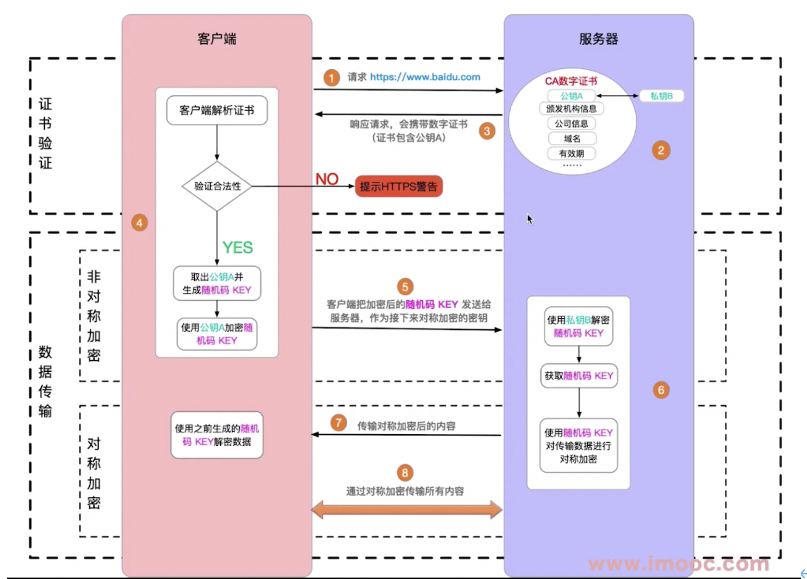

1. DOM(Document Object Model)是从HTML文件解析出来的一棵树
2. 获取DOM节点
  a)document.getElementById
  b)document.getElementsByTagName
  c)document.getElementsByClassName
  d)document.querySelectorAll
3. property和attribute
  a)peoperty修改对象属性，不会体现在html结构中 【推荐】
  b)attribute修改html属性，会改变html结构
  c)都可以引起dom重新渲染
4. 节点操作
  a)新建：constr  p1 = document.createelement(p)
  b)插入：div1.appendchild(p1)
  c)移动：div2.appendchild(p1)
  d)删除：div1.removeChild(child[0])
  e)获取父元素：p1.parentNode
  f)获取子元素列表：div1.childNodes文本元素也会算进去
```js
Const divChildNodesP = Array.prototype.slice.call(div1.childNodes).filter(child =>{
	If( child.nodetype == 1){    //过滤text元素
		Return ture
  }return false
})
```
5. DOM性能优化
  a)对DOM查询做缓存
  b)将频繁操作改为一次性操作:可以创建一个文档碎片，最后再统一插入到dom中
```js
const frag = document.createDocumentFrament()
for(let x = 0;x<10;x++){
  frag.appendChild(document.createElement("li"))
}
Dom.appendChild(frag)
```
6. BOM操作
a)判断当前浏览器信息const ua = navigator.userAgent
  Const isChrome = ua.indexOf(‘Chrome’)
b)Screen.width/screen.height
c)History.  Back/forward
d)Location
  location.href整个网址
  location.protocol协议，比如https
  location.host域名
  location.search取查询参数
  location.hash取井号后面的内容
  location.pathname取路径
7. 事件捕获
是先由最上一级的节点先接收事件，然后向下传播到具体的节点
当用户点击了某元素，采用事件捕获，则click事件将按照document—>html—>body—>div的顺序进行传播
8. 事件冒泡
会先触发最里层的事件，然后由于事件冒泡，父元素绑定的事件也会触发，如果不想触发父元素的事件需要阻止冒泡    
Event.stopPropagation()可以阻止冒泡    
9. 事件代理   
事件代理即把本来子元素绑定的事件托付给父元素绑定。如果有多个子元素需要绑定同样的事件，可以直接绑定给父元素，可以在绑定时做判断排除掉不需要绑定的节点，原理基于DOM元素的事件冒泡。   
从而代码简洁、并且可以减少浏览器内存占用，但不要滥用    
10. 存储
- Cookie是http请求的一部分
本身用于浏览器和server通讯，被借用到本地存储来
存储大小最多4kb、请求的时候会发送到服务端，增加请求数据量
只能用document.cookie修改追加或者覆盖
- localStorage和sessionStorage
html5专门为存储而设计，最大可存5M，不会随着请求发出去      
API简洁setItem getItem会强制类型转换为字符串形式   
区别：localStorage数据永久存储，除非手动删除；    
sessionStorage只存在于当前会话，浏览器关闭则清空   
11. Ajax【基础且重点】
是XMLHTTPRequest的一个实例，格式零散，容易出现回调地狱的问题
```js
const xhr = new XMLHttpRequest()  //浏览器通过XHR进行通信
xhr.open('Get','/data/test.json',true)  //初始化请求，true为异步的请求
xhr.onreadystatechange = function(){
  //readystate属性存当前的状态信息，状态变化时候触发函数
  //0:请求未初始化，还没有调用send方法
  //1:服务器建立连接，载入正在发送
  //2:请求已接受，载入完成
  //3:请求处理中，交互，正在解析响应内容
  //4:请求已经完成，且相应已就绪，响应内容接续完成可在客户端调用
  if(xhr.readyState === 4){
    if(xhr.status === 200){ //状态码，2XX成功，3XX重定向，4XX客户端错误，5XX服务器端错误
      console.log(JSON.parse(xhr.responseText))
    }
  }
}
xhr.send(null)  //发送请求
//如果是post
xhr.open('POST','/login',false)
xhr.send(JSON.stringify({userName:'lalal'}))
```
【手动封装ajax请求】
```js
function ajax(url){  //之后可以使用.then .catch
  const p = new Promise((resolve,reject)=>{
    const xhr = new XMLHttpRequest()
    xhr.open('GET','/data/text.json',true)
    xhr.onreadystatechange = function(){
      if(xhr.readyState === 4){
        if(xhr.status === 200){ 
          resolve(JSON.parse(xhr.responseText))
        }else if ...
      }
    }
    xhr.send(null) 
  })
  return p
}
```
12. axios
支持浏览器也支持node.js，也是基于promise
【拦截器：可以在发请求之前拦截也可以在收到请求之后拦截，比如发请求前让用户重新登陆】   
```js
// 请求拦截器
instance.interceptors.request.use(req=>{}, err=>{});
// 响应拦截器
instance.interceptors.reponse.use(req=>{}, err=>{});
// use(两个参数)
axios.interceptors.request.use(req => {
    // 在发送请求前要做的事儿
    ...
    return req
}, err => {
    // 在请求错误时要做的事儿
    ...
    // 该返回的数据则是axios.catch(err)中接收的数据
    return Promise.reject(err)
})
```
13. fetch
是原生支持的，是window的一个方法，不是封装的xhr，但兼容性不好
属于**关注分离设计思想**，一步步关注是否成功，先看是否连接服务器成功，再看是否请求数据成功   
服务器返回400 500 状态码时并不会reject，只有网络出错导致请求不能完成时，fetch才会被reject   
fetch请求默认是不带cookie的，需要设置fetch（URL，{credentials:’include’})   
14. 同源策略
同源：协议、域名、端口，三者必须一致（出于安全考虑）    
加载图片、css、js时可以无视同源策略    
- JSONP：
可以使用script标签的src发送请求（script标签可以跨越限制），然后再定义一个回调函数。但是不能发送post请求   
- CORS:纯服务器设置
- 配置NGINX反向代理
- img标签可以无视同源策略，可用于统计打点，可使用第三方统计服务（即统计用户页面某处的点击数或者执行到程序中某个点的次数）    
15. http缓存
为了加载速度更快需要缓存，可以缓存静态资源，比如js css img
- 强制缓存：浏览器初次向服务器端发送请求，服务器端返回数据和cache-control，再次请求时本地缓存返回资源。当缓存过期时再次向服务器端发送请求
Cache-control：max-age缓存时间，单位是秒     
  no-cache不用本地缓存正常向服务器端请求     
  no-store不用本地缓存也不用服务端缓存措施     
  private只允许最终设备进行缓存     
  public允许中间路由进行一定的缓存     
	expires同在response headers中，同为控制缓存过期，但比较老已经被代替     
- 协商缓存（对比缓存）：服务端缓存策略     
服务端判断这个资源是否要缓存，服务端判断客户端资源是否和服务端资源一样     
判断一致返回304，否则返回200和最新的资源     
浏览器初次向服务器端发送请求，服务器端向浏览器返回资源和资源标识，下次浏览器再次请求时会带着资源标识，服务器端会返回304或返回资源和新的资源标识     
资源标识在response headers中有两种，Last-Modified表示资源最后修改时间     
Etag表示资源的唯一标识     
- 不同的刷新操作对应不用的缓存策略     
正常操作：强制缓存有效、协商缓存有效     
手动刷新：强制缓存失效、协商缓存有效     
强制刷新：强制缓存失效、协商缓存失效   
16. http和https区别
(1)	http是明文传输，敏感信息容易被中间劫持，默认80端口
(2)	https = http + 加密，劫持了也无法解密，默认443端口
17. https加密算法
加密方式：对称加密，非对称加密；
对称加密：一个key同时负责加密和解密
不安全，如果只劫持了后面的数据安全，但如果劫持了key就可以被解密
非对称加密：一对key，A加密后只能用B解密
		   私钥、公钥
(1)	服务器端会把公钥传递给客户端，之后服务器端用公钥加密，但服务器端用私钥解密
(2)	私钥不可能被劫持，所以安全
【总的过程】
(1)	先使用非对称加密：服务器端向客户端传输公钥，客户端把一串字符用公钥加密传递给服务器端，服务器端用自己的私钥解密出来。这时两方都有这个安全的字符
(2)	再使用对称加密：把上面获得的字符作为key，每次用这个key加密
如果全用非对称加密则成本太高，对称加密效率高很多成本低
https证书（类似于备案）
中间人攻击：中间替换的方式，即当传pubkey时换成他自己的pubkey
使用第三方证书（慎用免费、不合格的证书，可能会被调包篡改）
浏览器校验证书
(1)	服务器端从第三方机构获取一个证书，这个证书中包含了pubkey和key
(2)	浏览器端支持第三方机构的校验 
(3)	服务器端把证书信息发送给浏览器端，浏览器端验证证书是否合法，如果不合法则交给用户判断，浏览器给出一些建议
(4)	中间人替换的时候浏览器会发现证书是假的
 