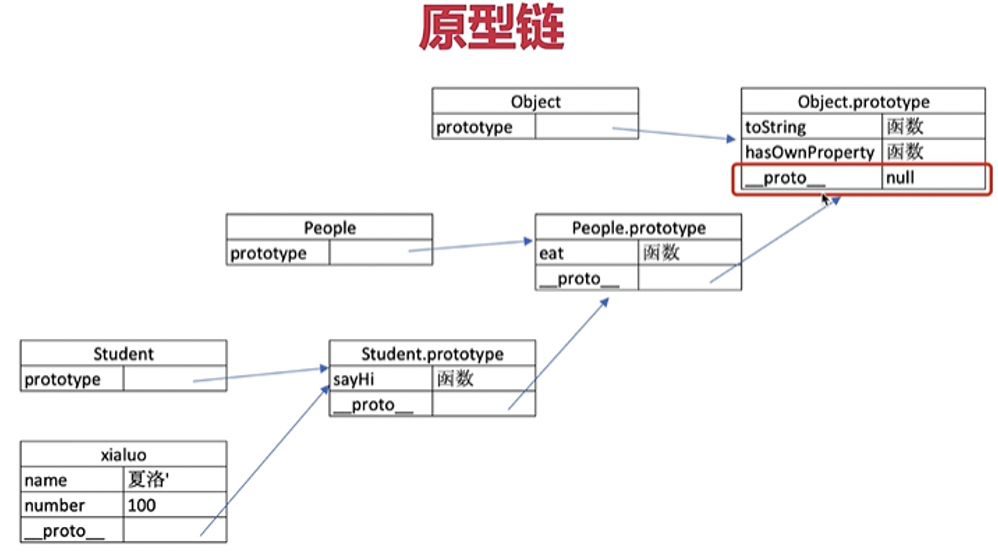

1. 值类型 & 引用类型
 - 值类型内容存储在栈中；引用类型栈中存储地址、对象内容存在堆里    
 - 值类型：string number boolean undefined symbol【undefined必须用let定义】    
 - 引用类型：null、对象、数组、函数  【null是特殊的引用类型，相当于空对象】    
 【备注】null是特殊的引用类型，相当于空对象；函数也是特殊的引用类型    
  📌undefined类型    
    表示声明了但未初始化，在比较undefined字面值时两者相等     
    永远不必显示地声明变量值为undefined，undefined必须用let定义    
  📌null类型   
      表示一个空对象的指针，在将来要保存对象值的变量建议初始化null   
      null与undefined表面上相等，即==相等（因为==操作符会为了比较转换为操作数）   
  📌boolean类型   
      因为js区分大小写，所以True False不是布尔值❌   
  📌number类型   
      不同的数值类型有不同的数值字面量格式：0开头八进制、0x十六进制等   
      &emsp;&emsp;☞浮点值   
      浮点值的存储内存空间是整数的两倍，如果.后面没有数字或者跟着0都会视为整数   
      由于IEEE754这个规范采用双精度存储，占64bit，🔔有存储限制不能表示所有的数，0.1+0.2 != 0.3‼️    
      &emsp;&emsp;☞科学计数法，e后面跟着10的幂数；无穷大与无穷小 Infinity -Infinity.  isFinite()确定是不是有限大   
      &emsp;&emsp;☞NaN    
      用于表示本来要返回数值的操作失败了，比如非法计算，而不是报错   
      NaN != NaN ，任何包含NaN的操作最终都返回NaN   
      isNaN会尝试把它转换为数值，如果不能转换返回true     
  📌String类型   
      转义字符：用于表示非打印字符或其他用途字符，包含多个字符长的转译序列仍算一个字符   
      模板字面量：反引号内保留换行字符、空格，可以跨行定义字符串（回车换行、几个空格也会算进去）
      模版字面量支持字符串插值，通过${ }实现，插入的值会使用toString强制转换为字符串   
      在插值表达式中可以调用函数和方法     
2. var let const区别     
 - var：可根据位置定义局部变量、全局变量，如果省略var则可以创建一个全局变量      
  **声明提升：会自动把变量声明提升到函数作用域的顶部 ❗**  
  合并：反复声明同一个变量没问题，会自动将多余的声明在作用域顶部合并为一个声明     
  For循环定义的迭代变量会渗透到循环体外部，迭代变量保存的是导致循环退出的值   
```js
  for(var I =0;i<5;i++){
      setTimeout(()=>console.log(i))        //都是5，所有的i都是同一个变量
  }
```
  【可以通过let或立即执行函数实现效果】
 - let： 块级作用域    
   不会在作用域中被提升，声明前面被称为“暂时性死区”    
   不允许在同一个块级作用域中出现冗余的重复声明    
   不能依赖条件声明模式（即if什么再let，离开if找不到变量）    
  **Js引擎在后台会为每个迭代循环声明一个新的迭代变量，循环内每个setTimeout引用的都是不同的变量实例，不会被覆盖**     
  **let定义的块级作用域，绑定事件可以逐个绑定（全局触发时候才绑定，迭代变量都是最后一个值）**     
 - const: 块级作用域、不允许重复声明
  声明时必须同时初始化变量（赋值），不能修改否则报错    
  const声明的限制只适用于它指向的变量的引用，如果是一个对象，修改对象内的属性不违反限制    
  const不能用来声明迭代变量（迭代变量自增）    
  可以用const声明一个不会被修改的for循环变量，对for of \for in有用【遍历对象属性、数组】    
  使用const可以让静态代码分析工具提前发现不合法的赋值操作   
 - 【自由变量】   
自由变量：一个变量在当前作用域没有定义，但是引用了，就层层往上找，没有报错undefined   
自由变量的查找，是在函数定义的地方❗，向上级作用域查找，不是在执行的地方   
3. typeof运算符
  **识别所有值类型、识别函数、可以判断是否为引用类型**    
  **string number boolean undefined symbol object function**    
  【typeof null === 'object'】
4. instanceof
  **instanceof是基于原型链实现的，顺着隐式原型往上找**   
  可以判断引用类型，可以判断类属于哪个class或构造函数
5. 深拷贝
【手写深度比较】
```js
function deepClone(obj){
  if(typeof object !== 'object' || obj == null){
    return obj
  }
  let result
  obj instanceof Array ? result = [] : result = {}
  for(let key in obj){
    if(obj.hasOwnProperty(key)){  //是自己的属性，保证key不是原型的属性
      result[key] = deepClone(obj[key])
    }
  }
  return result
}
```
深拷贝方法
 - let obj2 = JSON.parse(JSON.stringify(obj)) //不可以拷贝 undefined function RegExp 等类型
 - let obj2 = Obejct.assgin({},obj1) //只能拷贝一层，如果对象的属性是引用类型则还只是拷贝了引用
6. 类型转换
  除了 == null 都用 === 【==null相当于 (===null || ===undefined)】
  强制类型转换：parseInt parseFloat toString
  隐式类型转换：if \ == \ +
  赋初始值的时候可以let str = 'abc' || ""
7. 原型
 - 隐式原型__proto__
 - 显式原型prototype
 **每个实例都有隐式原型__proto__，每个class都有显示原型prototype**
 xialuo.__proto__ === Student.prototype
 通过new实例化的对象，的隐式原型指向构造函数的显示原型
 寻找属性或者方法的时候，先在自身属性方法中寻找，没有再去隐式原型__proto__中寻找
 
8. 闭包：在外部访问函数里的变量
- 函数作为返回值被返回
- 函数作为参数被传递
```js
function create(){
  const a = 100
  return function(){  //内部函数作为返回值被传递
    console.log(a)
  }
}
const fn = create()
const a = 200
fn()  //100
/* =========================== */
function print(fn){
  const a = 200
  fn()  //内部函数是外部传来的参数
}
const a = 100
function fn(){
  console.log(a)  //！！！自由变量的寻找是在函数定义的地方
}
print(fn)  //100
```
应用：缓存数据 闭包可以隐藏数据，只提供API
```js
function createCache(){
  const data = {} //闭包中的数据隐藏，对外提供API
  return {
    set:function(key,value){  //必须用set改变值
      data[key] = val
    }
    get:function(key){
      return data[key]
    }
  }
}
```
9. this
**this的取值是在函数执行的时候决定的，不是定义的时候❗**   
改变this指向:call直接执行改变、bind会返回新函数
```js
const zhangsan = {
  name:'lalala'
  sayHi(){
    console.log(this) //指向当前对象
  },
  waitAgain(){
    setTimeout(funcion(){
      console.log(this) //window,因为触发函数的是srtTimeout
    })
     setTimeout(() => {
      console.log(this) //当前对象，因为箭头函数的this永远取上级作用域的this
    })
  }
}
```
【模拟bind函数】
```js
Function.prototype.bind1 = function(){
  const args = Array.prototype.slice.call(rguments) //多个传参拆解为数组
  const t = args.shift()
  const self = this
  return function(){
    return self.apply(t,args)
  }
}
```