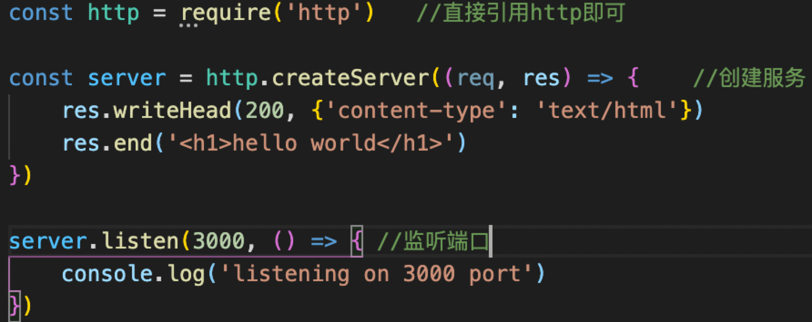
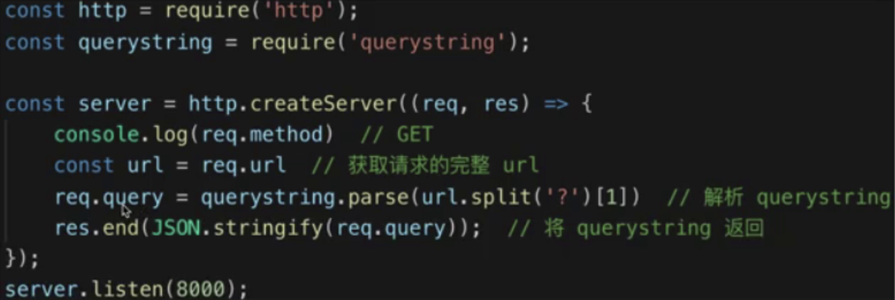
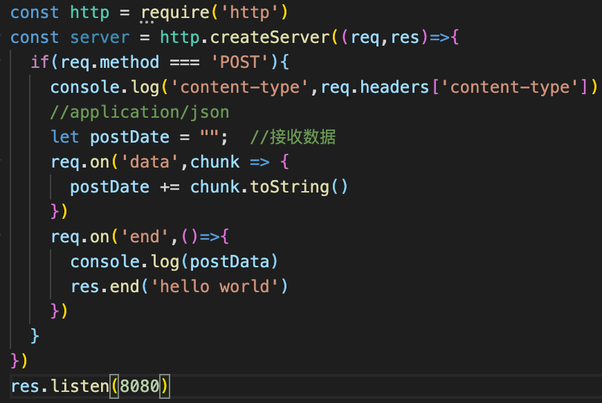
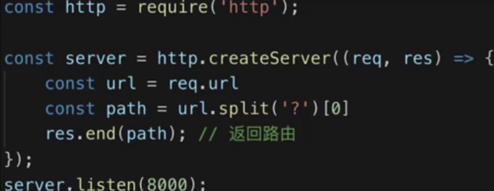
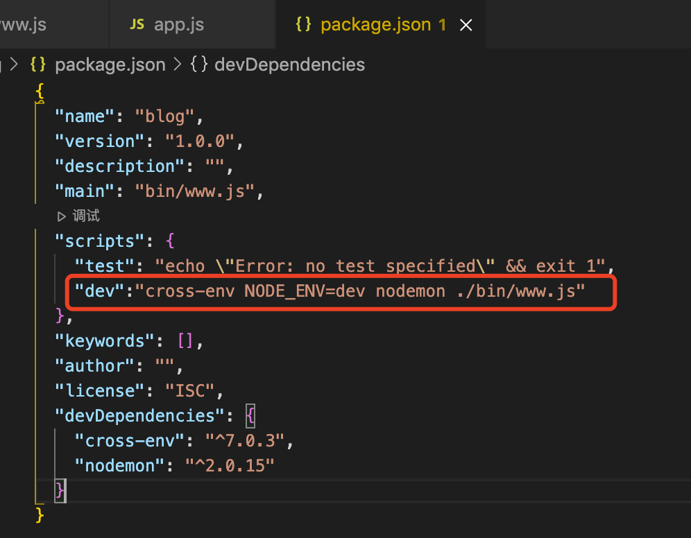
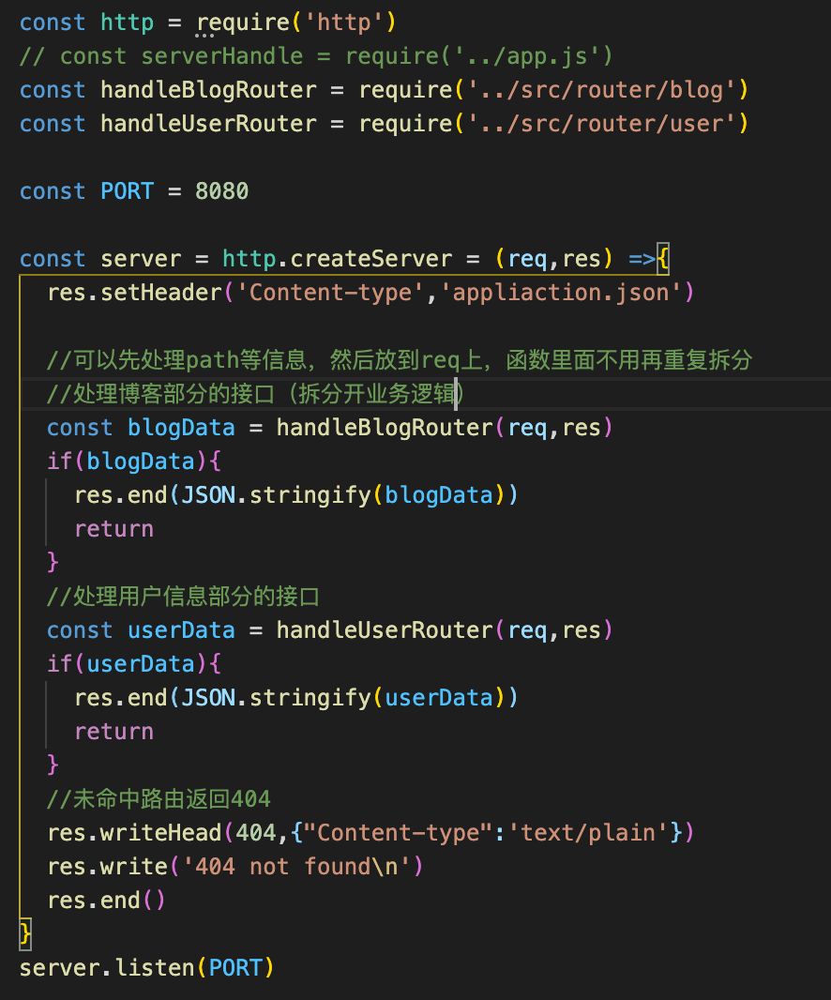
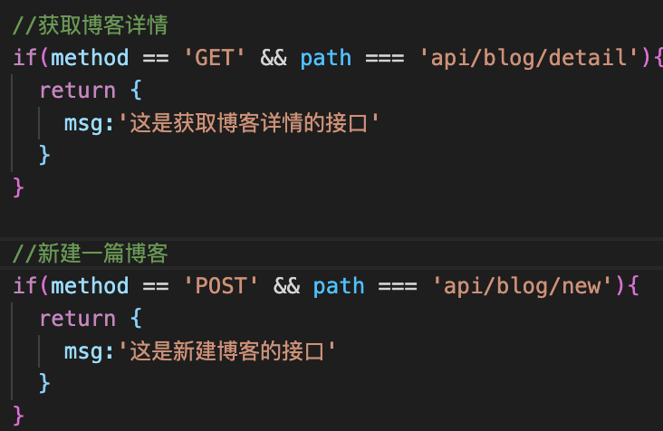

一、基本概念

**1.Nodejs是一个js的运行环境**，可以运行在服务器作为webserver，也可以运行在本地，作为打包、构建工具

2. nodejs. vs  js

- ECMAScript(es)  定义了语法，包括定义变量、循环判断、原型异步等，是写js和nodejs都要遵守的;但不能操作dom\http请求
- js   es+web Api(w3c)
- nodejs    es+nodeApi

3. common js

commonjs是node默认的模块化规范：导出modules.export.  导入require

4. 基本用法

5. nodejs基于inspect协议的调试方式

在谷歌浏览器中调试通断点等待：1.设置默认端口9229  2.打开谷歌浏览器的inspect窗口

Node v6.3+ 的版本提供了两个用于调试的协议：v8 Debugger Protocol 和 v8 Inspector Protocol

> v8 Debugger Protocol 是 Node v6.3 之前的版本就支持的调试协议，使用一个 TCP 端口（通常是 5858）与Client/IDE 交互，其工作原理如下：
>
> 1. 使用 node --debug=5858 yourScript.js 启动你的 js 脚本，则 node 在运行脚本时会将 5858 作为调试端口
>
> 2. 启动 node-inspector，它会开启一个后台进程，通过 8080 端口提供 http 服务。
>
> 3. 在浏览器中打开 http://127.0.0.1:8080/?port=5858]则会连接到 node-inspector 后台进程，同时告诉后台连接使用 5858 作为调试端口的 node 进程。后台会提供一个类似于 chrome devtools 的 UI 调试界面。
>
> （访问8080，5858是一个调试的端口，后台调试）
>
> v8 Inspector Protocol 是 node v6.3 新加入的调试协议，通过 websocket （通常使用 9229 端口）与 Client/IDE 交互，同时基于 Chrome/Chromium 浏览器的 devtools 提供了图形化的调试界面。
>
> 1. 使用 node --inspect=9229 yourScript.js 启动你的脚本，9229 是指定的端口号
>
> 2. 在地址栏输入 chrome://inspect/#devices
>
> （即可在浏览器调试）

在谷歌浏览器中调试

6. http请求概述

DNS解析域名，建立TCP连接，发送http请求 -> server接收到http请求后处理并返回、客户端收到数据处理并渲染

7. nodejs处理http请求

- get请求通过querystring传递数据

服务端通过query string.parse解析成一个对象

res返回时需要返回字符串，所以需要JSON.stringify封装一下

- post请求

- 处理路由

- 设置返回格式为 JSON

​    res.setHeader('Content-type', 'application/json') 【纯文本"Content-type":'text/plain'】

8. 搭建开发环境

使用nodemon检测文件变化，自动重启node

使用cross-env设置环境变量，兼容mac linux windos

可以通过设置环境变量区分是生产环境还是线上环境，从而走不同的日志和数据库

安装生产环境依赖npm install nodemon cross-env --save-dev

搭建之后的基本代码

部分接口

