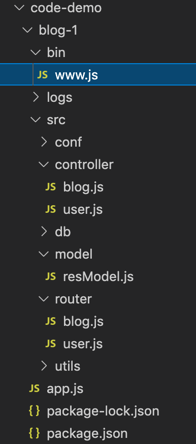
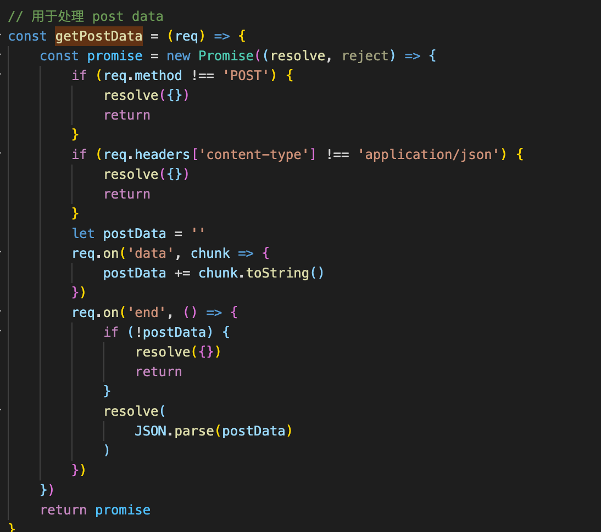
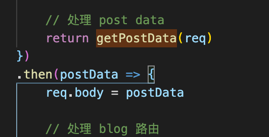
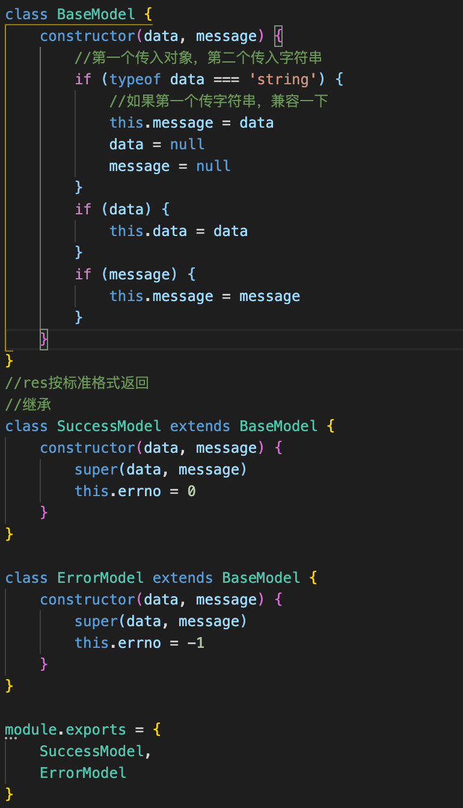

1. 目录结构

www.js：存放与创建服务相关的内容。createServer、prot、listen等

app.js：公共处理请求数据、引入大致的路由函数处理。比如解析 query、cookie等

router下：纯路由处理，判断每个接口，业务只是引入函数

controller下：接收需要的参数，编写业务逻辑

model/resModel：使res按标准格式返回

2.获取post请求数据

由于获取postData是需要等待的，可以new Promise获取

把获取postData封装成一个函数，获取req之后调用，.then返回接收的参数，可以放到req里再传给处理路由的函数

3.resModel

每次把处理好的返回值传进去格式化成为标准格式给前端

