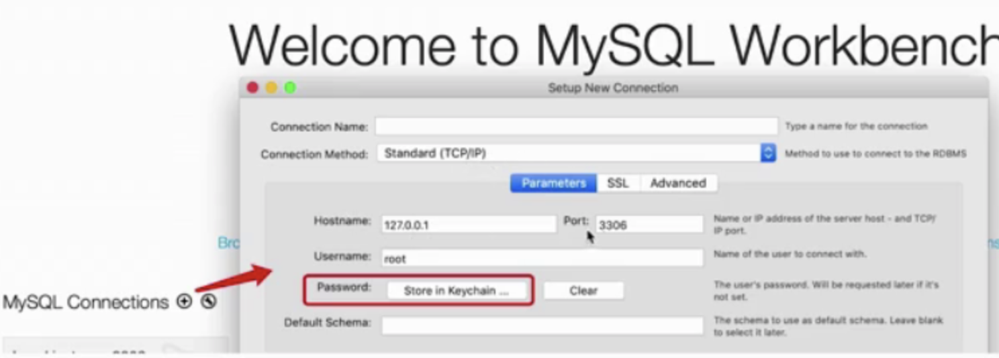
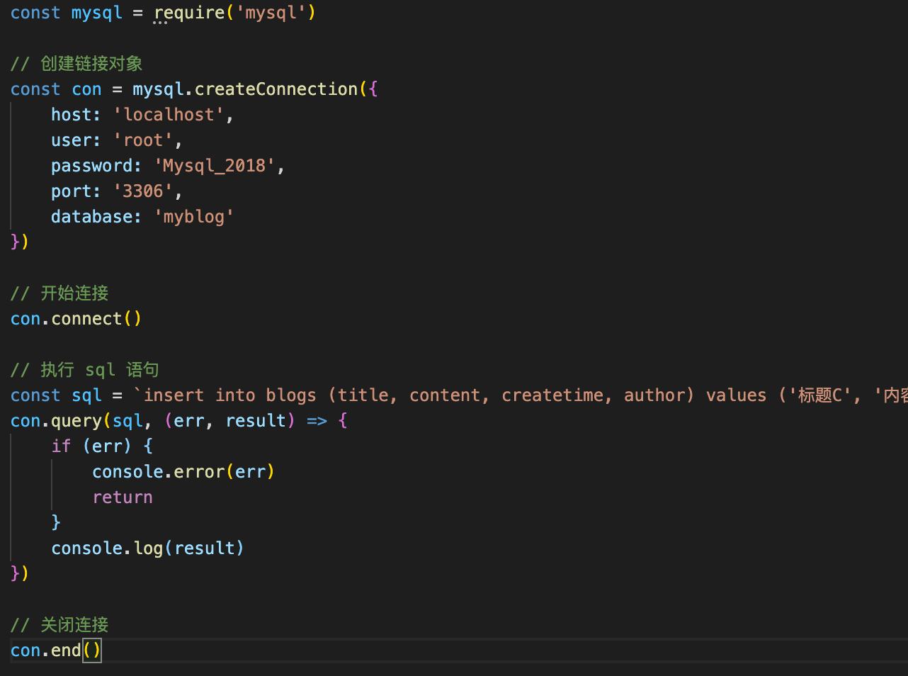
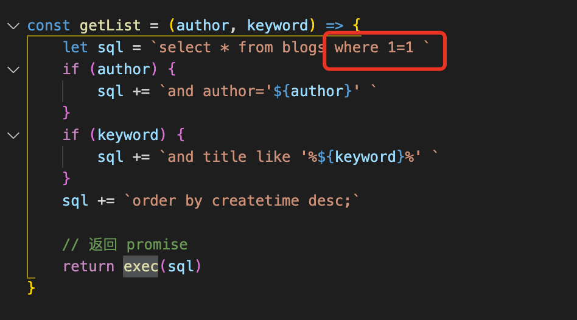
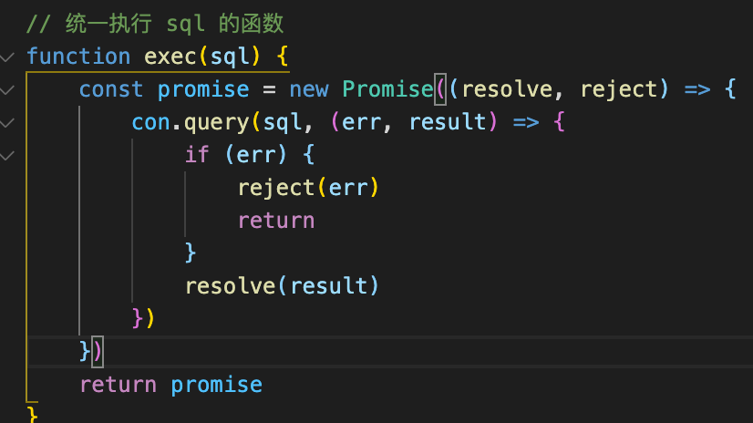
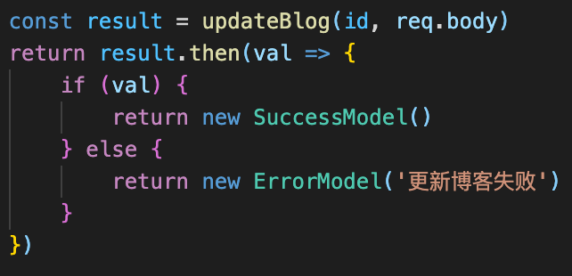

1.准备环境

mysql

可视化工具mysql workbench

2.操作数据库

- 建库

select * from 表名

use mysql;		//显示库中的数据表
show tables;

- 建表

create table 表名 (字段设定列表)

drop database 库名;
drop table 表名；

- 表操作

select * from 表名 where order by  \  update set \ delete \insert into values 

软删除的话不直接删除数据，而是添加状态的标记

如果列名是关键字的话 `password``使用反引号

3.Nodejs操作Mysql

npm i mysql

单独创建一个文件配置数据库信息，需要判断环境变量，如果是生产环境\线上环境配置不同，最后返回promise

【new Promise((resolve,reject)=>{  resolve()})】

1)业务逻辑

2)数据库处理

3)路由：因为返回的是promise，所以路由的结果也要写成.then的格式

