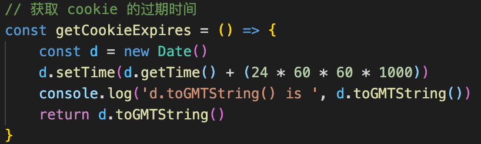
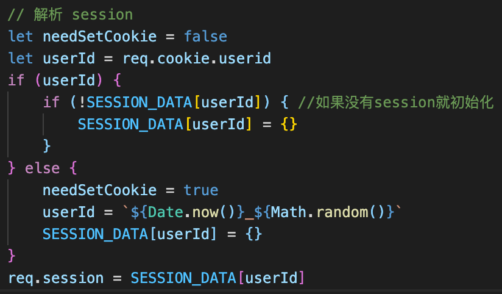
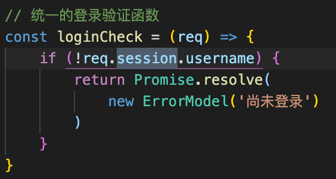
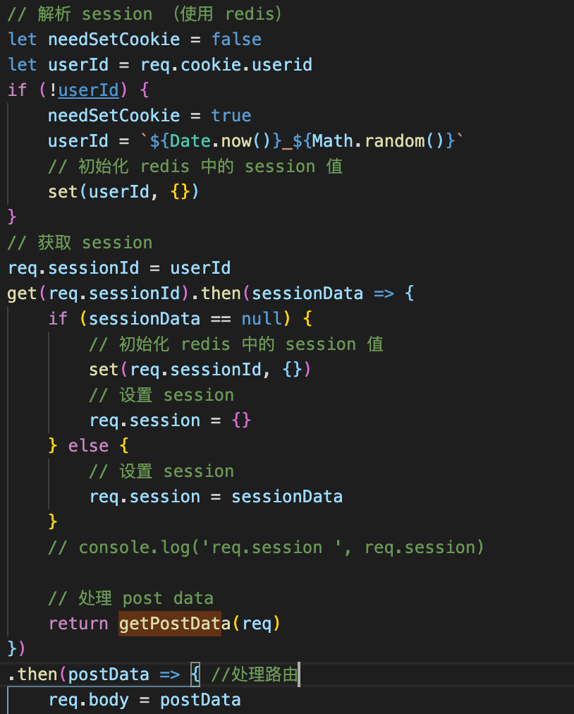
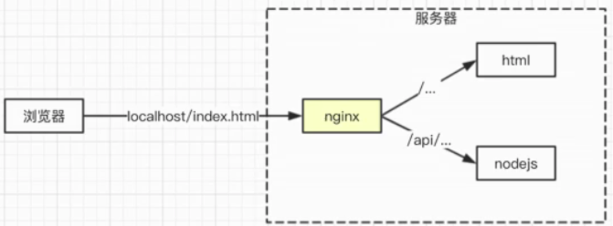
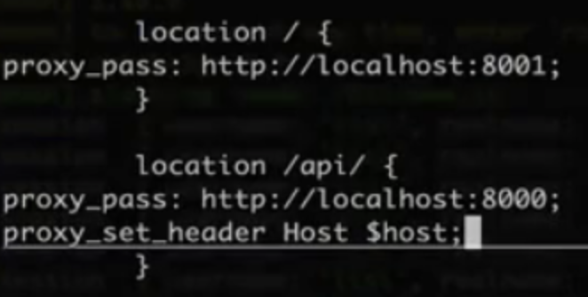

1. cookie

- 存储在浏览器的一段字符串（最大5kb）
- 跨域不共享
- 是结构化数据 key=value;
- 每次发送http请求，会将请求域的cookie一起发送给server
- server端可以修改cookie并返回给浏览器
- 浏览器中也可以通过javascript修改cookie（有限制）
- 客户端可以累加cookie
- cookie跨域不共享

2. nodejs操作cookie

获取解析cookie

const cookieStr = req.headers.cookie || ''   之后再用分号拆分

后端设置httpOnly可以限制不让客户端做修改，如果客户端追加了就覆盖掉

后端设置expires过期时间

<!--  -->

3. session

- 存储会话信息(存储特定用户会话所需的属性和配置信息)

session是一种解决问题的方法，cookie存储数据大小有限，可以在cookie中存储userId（随机字符串），然后通过userId读取session中的username等信息

如果cookie中没有userId,先设置一个标志，需要生成新的cookie；如果没有session内容，先初始化一个空对象

req.session = SESSION_DATA[userId]

SESSION_DATA为后端的一个JS变量，存储在进程被操作系统分配的内存中

1⃣️初始化、解析数据

<!--  -->

2⃣️登陆的时候session赋值

<!--  -->

3⃣️如果没有session的内容则认为还没登陆（会话信息尚未建立）

<!--  -->

4. redis

使用session的问题：存储在内存中可能会导致栈溢出；多进程或多机器多集群之间，数据无法共享

（主要问题是：如果下次用户登录名中的是其他的进程，则获取不到session数据）

mysql属于一种硬盘存储；redis是内存存储

内存读取数据速度快，但成本昂贵，可以扩展，但断电会丢失（做配置的话有备份方案，再做数据恢复）

- session适用于redis
  - session访问频繁，对性能要求高
  - session数据量不会太大
  - session可不考虑断电丢失数据的问题（存储的只是临时数据，丢了再登陆就行了）
  - 程序重启session如果是变量，则会清空，存到redis里只是退出了不会丢失
- 网站数据不适用于redis
  - 操作频率不高，没必要浪费资源
  - 断电不能丢失，要存mysql
  - 数据量太大，内存成本太高

安装：brew install redis. redis-server. redis-cli

起服务后会显示redis连的端口号

key-value式存储，set \ get \ delete \ keys *\

5. node链接redis——用redis存储session

1⃣️配置reids、创建客户端

2⃣️使用的时候，set方法最后传入redis.print可以打印输出；get是异步的可以传入回调函数

3⃣️quit退出

上面的try catch不是为了捕获异常，是为了兼容JSON的格式，不是JSON解析的返回resolve即可

登陆的时候也需要把session的内容存储到redis中

在处理业务的时候（需要获取user的时候，比如新增博客），先做登陆检验，拦截没有登陆的用户

6. nginx代理联调接口

nginx

- 高性能的web服务器，开源免费
- 一般用于做静态服务、负载均衡
- 反向代理

正向代理，比如过客户端访问什么访问不到，需要使用代理工具，即浏览器能控制的代理

不同的请求，代理到不同的地方

brew install nginx

nginx -t 检查格式是否正确

nginx启动

nginx -s reload重启

nginx -s stop停止

配置文件：/user/local/etc/nginx/nginx.conf

worker_processes 2;  cpu是几核的，可以启动多个进程，不写默认启动一个进程

server 中的listen 8080

​					location / {} 如果地址是/开始的话，做代理，代理到前端路径 【不写冒号】

