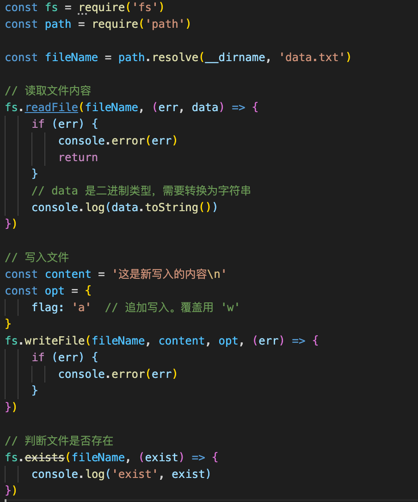
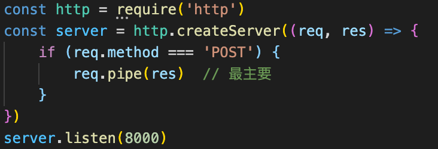
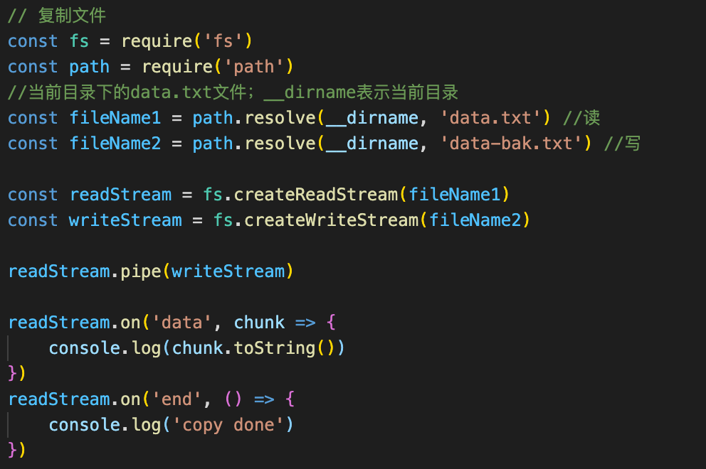
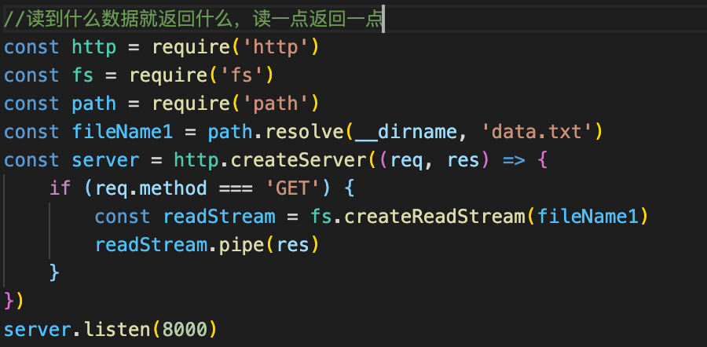
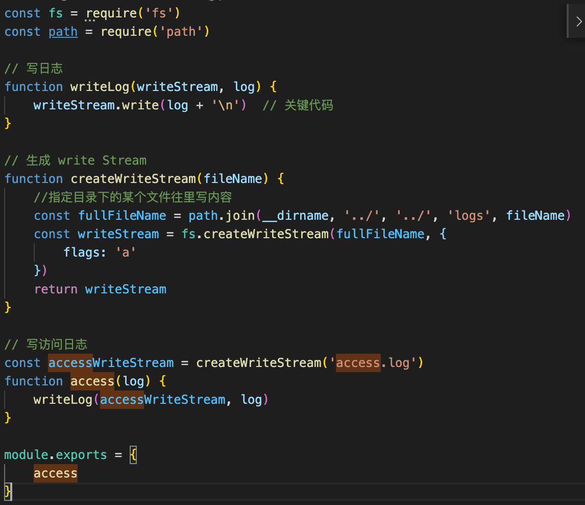

1. 概述

- 访问日志【最重要】
- 自定义日志（包括自定义事件、错误记录等）

2. 文件操作——基本Api



3. 管道

IO操作本身很慢，按基本文件操作会导致大文件占用内存太大

管道把接收的数据和输出的地方连接起来，接收一点传出去一点

标准输入输出：process.stdin.pipe(process.stdout)

node接口里面的参数req.res本身就封装了流的特性，可以直接使用pipe管道连接



4. node对文件流stream操作





5. 写日志

1⃣️创建写文件的流

2⃣️写入内容

3⃣️可以在调接口的位置引用封装好的方法



6. 拆分日志

实现方式：linux的crontab命令执行定时任务

设置定时任务格式，分钟 小时 日期 月份 commond	可以用*代替

将日志文件拷贝并重命名为带日期的日志文件名称，然后清空内容继续积累日志

执行文件copy.sh（开头标志一下）【shell脚本】

```
#!/bin/sh
cd /Users/wfp/Project/video-tutorial/node-tutorial/code-demo/blog-1/logs
cp access.log $(date +%Y-%m-%d).access.log
echo "" > access.log
```

7. 日志分析

使用nodejs的readline(基于stream效率高)一行行分析日志，因为是按行存储的

