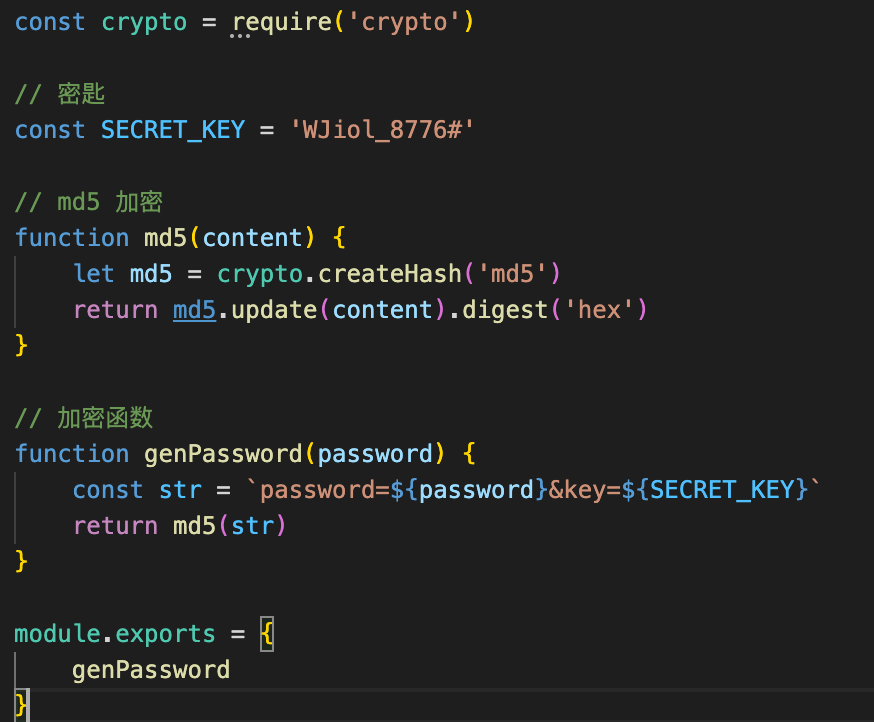

1. sql注入

   在输入用户密码的时候，输入 ;-- 会导致后面的sql语句被注释掉，会导致不管输入什么密码都能登陆

   使用escape() 函数可对字符串进行编码，把用户输入的；转译

   不管用户输入什么用户名都会以字符串的形式存入，不会导致后面的代码注释掉或注入其他代码

2. xss攻击

   用户在网页输入的时候输入一段<sprict></sprict>script标签代码，给网页注入js语句获取到当前的cookie等信息

   可以把尖括号使用npm i xss提供的方法转译，使script标签变为纯字符串

3. 密码加密

   如果数据库万一被攻击，最不能丢失的就是用户信息

   为了防止黑客获取用户密码，所以需要给用户密码加密

   

拿到密码时，加入密钥【密钥一定要保存好】，再进行md5加密