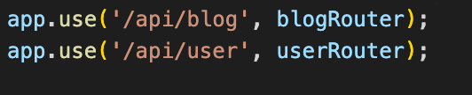
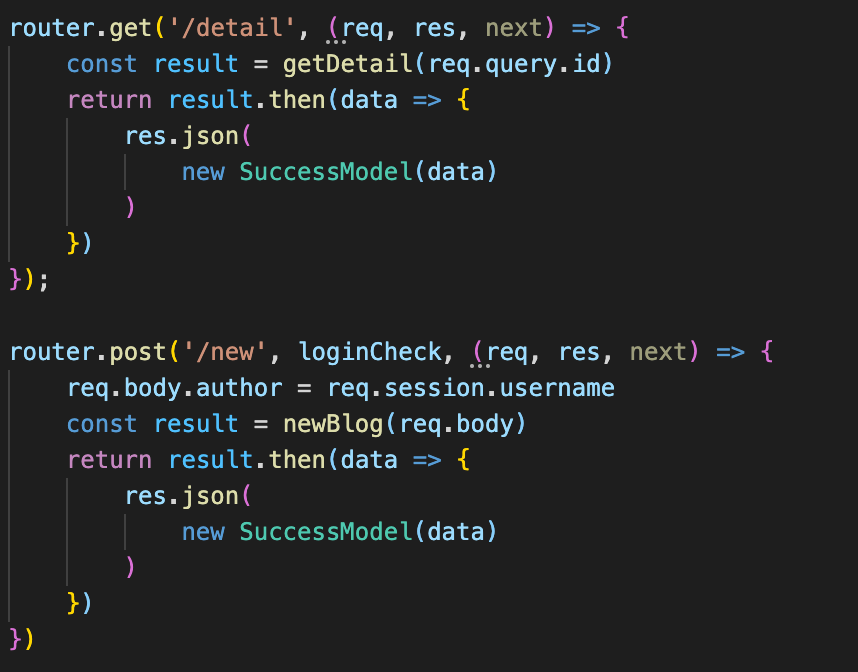
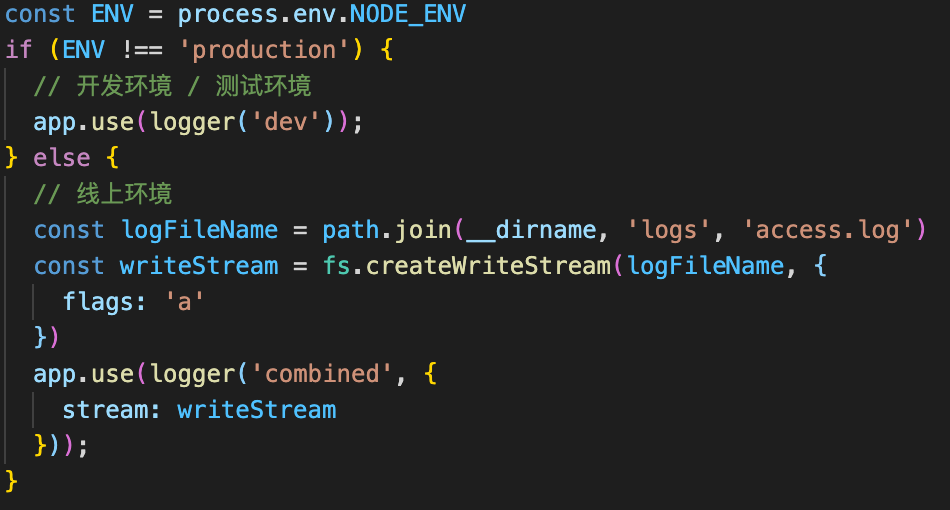

1. 使用

```  
npm install -g express-generator    全局安装脚手架工具
express-demo express   初始化项目
npm install     安装依赖
npm start				启动项目
```

2. express的入口代码

入口文件在bin目录下的www文件，里面有一些创建服务连接的配置信息

app.js是处理请求的公共方法，比如解析cookie

1）引用：var cookieParser = require('cookie-parser'); 插件解析cookie

2）注册：app.use(cookieParser());

3）路由中使用：直接req.cookies拿

【自己拿需要先从请求头里获取，再通过分号分割，再去掉空格获取】

mrogan插件可以写日志

app.use(express.json()); 		可以解析postData中的json格式的数据

app.use(express.urlencoded({ extended: false }));		兼容其他格式的数据

之后从req.body中取数据

var app = express()    初始化app

app.js这里路由设置的是根目录



routes里更简洁的路由，是子路由



3. 中间件

1）app.use用来注册中间件，先收集起来

2）遇到http请求，根据path和method判断触发哪些

3）实现next机制，即上一个通过next触发下一个

代码实现

```javascript
const http = require('http')
const slice = Array.prototype.slice

class LikeExpress {
    constructor() {
        // 存放中间件的列表
        this.routes = {
            all: [],   // app.use(...)
            get: [],   // app.get(...)
            post: []   // app.post(...)
        }
    }
    register(path) {
        const info = {}
        if (typeof path === 'string') {
            info.path = path
            // 从第二个参数开始，转换为数组，存入 stack
            info.stack = slice.call(arguments, 1)
        } else {
            info.path = '/'
            // 从第一个参数开始，转换为数组，存入 stack
            info.stack = slice.call(arguments, 0)
        }
        return info
    }
    use() {
        const info = this.register.apply(this, arguments)
        this.routes.all.push(info)
    }
    get() {
        const info = this.register.apply(this, arguments)
        this.routes.get.push(info)
    }
    post() {
        const info = this.register.apply(this, arguments)
        this.routes.post.push(info)
    }
    match(method, url) {
        let stack = []
        if (url === '/favicon.ico') {
            return stack
        }
        // 获取 routes
        let curRoutes = []
        curRoutes = curRoutes.concat(this.routes.all)
        curRoutes = curRoutes.concat(this.routes[method])
        curRoutes.forEach(routeInfo => {
            if (url.indexOf(routeInfo.path) === 0) {
                // url === '/api/get-cookie' 且 routeInfo.path === '/'
                // url === '/api/get-cookie' 且 routeInfo.path === '/api'
                // url === '/api/get-cookie' 且 routeInfo.path === '/api/get-cookie'
                stack = stack.concat(routeInfo.stack)
            }
        })
        return stack
    }
    // 核心的 next 机制
    handle(req, res, stack) {
        const next = () => {
            // 拿到第一个匹配的中间件
            const middleware = stack.shift()
            if (middleware) {
                // 执行中间件函数
                middleware(req, res, next)
            }
        }
        next()
    }
    callback() {
        return (req, res) => {
            res.json = (data) => {
                res.setHeader('Content-type', 'application/json')
                res.end(
                    JSON.stringify(data)
                )
            }
            const url = req.url
            const method = req.method.toLowerCase()

            const resultList = this.match(method, url)
            this.handle(req, res, resultList)
        }
    }
    listen(...args) {
        const server = http.createServer(this.callback())
        server.listen(...args)
    }
}

// 工厂函数
module.exports = () => {
    return new LikeExpress()
}
```

4. 写日志

