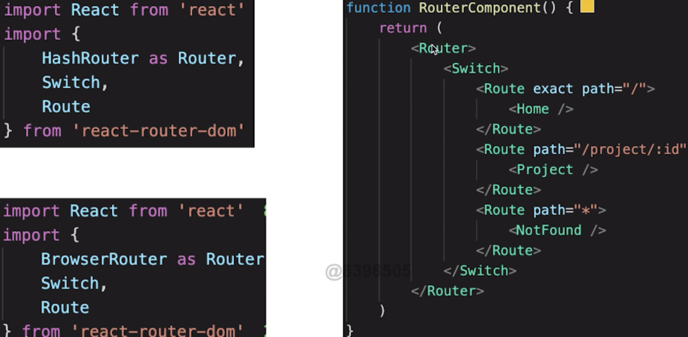
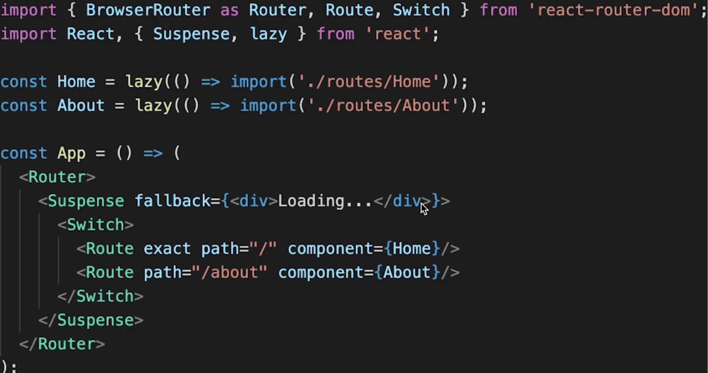

1. 路由模式
默认为hash模式 http://abc.com/#/user/10
可以使用H5 history模式 http://abc.com/user/20    需要后端支持

2. 路由配置
动态路由 path="/project/:id”
之后在组件中可以获取出来 const {id} = useParams( ) // import {useParams} from ‘react-router-dom’
可以使用Link组件跳转也可以使用history
import {useHistory} from ‘react-router-dom’
let history = useHistory()
histtory.push(‘/')
懒加载

3. 传递参数的三种方法
- search
- match
- state