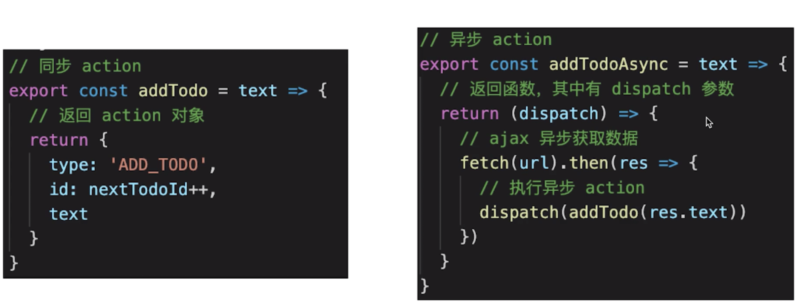
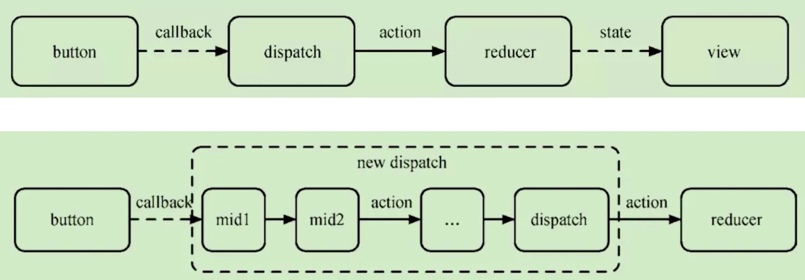
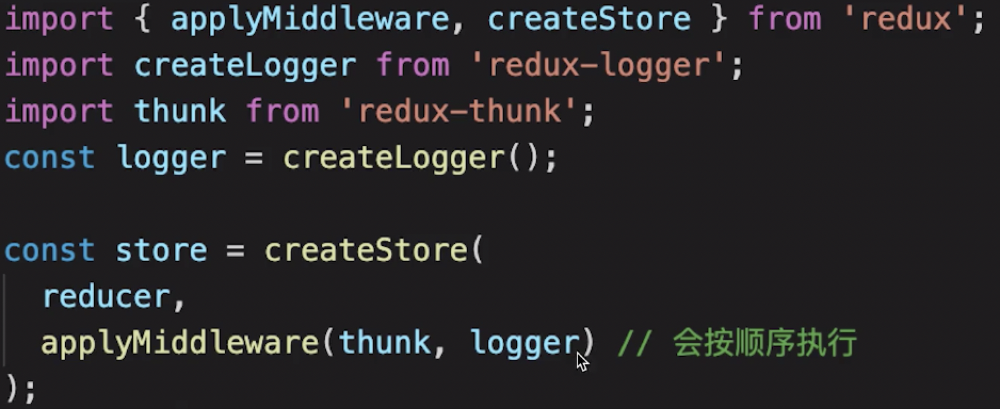
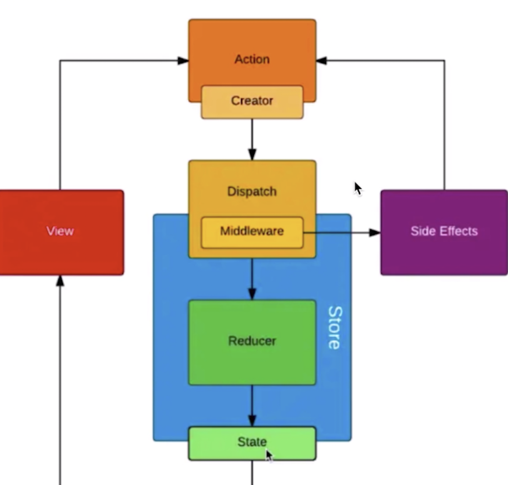

1. 基本概念
【store state action reducer】
reducer是形式为(satte,action)=> state的纯函数，描述了action如何把state转变成下一个state
（当state变化时需要返回全新的对象，而不是修改传入的参数）
* 通过reducer创建Redux store来存放应用的状态，API：subscribe, dispatch,getState
store.subscribe可以手动订阅更新，也可以事件绑定到视图层
* 改变内部state唯一方法是dispatch一个actions
store.dispatch({type:’INCERMENT’})    //1   action可以被序列化记录存储下来，后期可以回放执行
2. 单项数据流概述
dispatch(cation)    reducer-> newState    subscribe触发通知视图层更新
3. 其他知识点
* Provider
```js
import React from 'react'
import { Provider } from 'react-redux'
import { createStore } from 'redux'
import todoApp from './reducers'
import App from './components/App'

let store = createStore(todoApp)

export default function () {
    return <Provider store={store}>
        <App />
    </Provider>
}
```
* connect
其他组件想要有消费store的能力，需要通过connect高阶组件将dispatch作为props注入到组件中
AddTodo = connect()(AddTodo)
```js
// 函数组件，接收 props 参数
let AddTodo = ({ dispatch }) => {
  // dispatch 即 props.dispatch

  let input

  return (
    <div>
      <form
        onSubmit={e => {
          e.preventDefault()
          if (!input.value.trim()) {
            return
          }
          // 创建一个 todo
          dispatch(addTodo(input.value))
          input.value = ''
        }}
      >
        <input
          ref={node => {
            input = node
          }}
        />
        <button type="submit">
          Add Todo
        </button>
      </form>
    </div>
  )
}
```
* mapStateToProps mapDispatchToProps
```js
const mapStateToProps = state => {
  // state 即 vuex 的总状态，在 reducer/index.js 中定义
  return {
    // 根据完成状态，筛选数据
    todos: getVisibleTodos(state.todos, state.visibilityFilter)
  }
}
const mapDispatchToProps = dispatch => {
  return {
    // 切换完成状态
    onTodoClick: id => {
      dispatch(toggleTodo(id))
    }
  }
}
```
4.异步action

5.简述redux中间件原理


