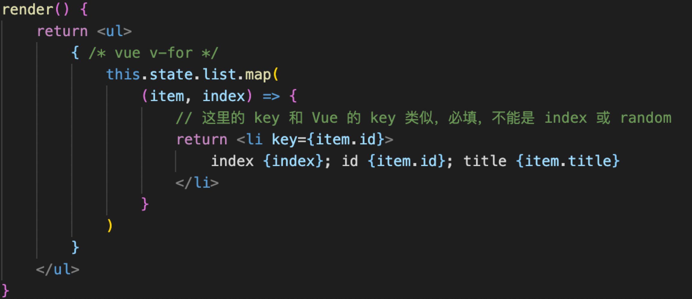

1. 变量、表达式
react的插值是使用一对{ }，{ }内可以写js变量、表达式
2. class style
className=“”     
style=“”     style={{ }} 中间第一个大括号代表要包一个js变量，里层大括号是对象标示
3. 子元素和组件
原生html
// 原生 html
``` javascript
const rawHtml = '<span>富文本内容<i>斜体</i><b>加粗</b></span>'
const rawHtmlData = {
    __html: rawHtml // 注意，必须是这种格式
}
const rawHtmlElem = <div>
    <p dangerouslySetInnerHTML={rawHtmlData}></p>
    <p>{rawHtml}</p>         //仅仅是文本
</div>
return rawHtmlElem
```
4. 条件判断：if eles \ 三元运算符 \ &&
5. 列表渲染

#### map是返回一个新的数组,list原本数组没有变