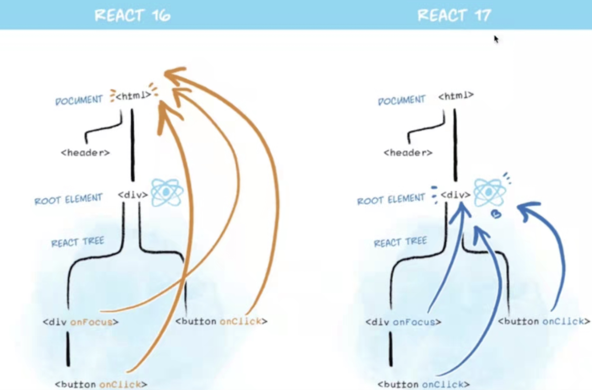

1. bind this
React事件写法：onXxxx. 比如onClick   
this一般在哪里运行指向哪里，react中的类都只是原型，如果不给类组件中的方法绑定this，则渲染时不是实例触发的函数，this则为undefined
（类中默认开启严格模式则为undefined，没开严格模式的话指向window）   
如果写为this.aaa = xxx()，只是把运行结果赋值给这个变量
如果写为this.aaa = xxx  this.aaa() 则调用的是原型上的方法，不是实例触发指向不对    
``` javascript
//点击事件的this
//可以在constructor中
this.a = this.clickHandler1.bind(this)
clickHandler1() { //这种写法需要，.bind(this)
// console.log('this....', this) // this 默认是 undefined
    this.setState({
        name: 'lisi'
    })
}
// 静态方法，this 指向当前实例（静态方法，this永远都会指向这个实例）
clickHandler2 = () => {  //箭头函数的this指向上一层的this
    this.setState({
        name: 'lisi'
    })
}
```
性能优化：
#### 在constructor构造器中bind（this）比较好，这样无论点击多少次都只bind一次；
如果是在render里面绑定，每点击一次都需要重新bind都要重新返回一个新的函数【效率不好】
2. event参数
如果默认什么参数都不传，第一个参数则为event参数
定义参数之后，最后都会追加一个参数可以接受event
```javascript
  return <a href="https://imooc.com/" onClick={this.clickHandler3}>
            click me
        </a>

    // 获取 event
    clickHandler3 = (event) => {
        event.preventDefault() // 阻止默认行为
        event.stopPropagation() // 阻止冒泡
        console.log('target', event.target) // 指向当前元素，即当前元素触发
        console.log('current target', event.currentTarget) // 指向当前元素，假象！！！

        // 注意，event 其实是 React 封装的。可以看 __proto__.constructor 是 SyntheticEvent 组合事件
        console.log('event', event) // 不是原生的 Event ，原生的 MouseEvent
        console.log('event.__proto__.constructor', event.__proto__.constructor)

        // 原生 event 如下。其 __proto__.constructor 是 MouseEvent
        console.log('nativeEvent', event.nativeEvent)
        console.log('nativeEvent target', event.nativeEvent.target)  // 指向当前元素，即当前元素触发
        console.log('nativeEvent current target', event.nativeEvent.currentTarget) // 指向 document ！！！

        // 1. event 是 SyntheticEvent ，模拟出来 DOM 事件所有能力
        // 2. event.nativeEvent 是原生事件对象
        // 3. 所有的事件，都被挂载到 document 上
        // 4. 和 DOM 事件不一样，和 Vue 事件也不一样
    }
``` 
#### 【React17开始，事件就不再绑定到document上了】
React16绑定到document（共用一个）；React17事件绑定到root组件（多个dom节点）；有利于多个react版本并存，例如微前端

3. 传递自定义参数
定义参数之后，最后都会追加一个参数可以接受event
``` javascript
// 传递参数
    clickHandler4(id, title, event) {
        console.log(id, title)
        console.log('event', event) // 最后追加一个参数，即可接收 event
    }
```