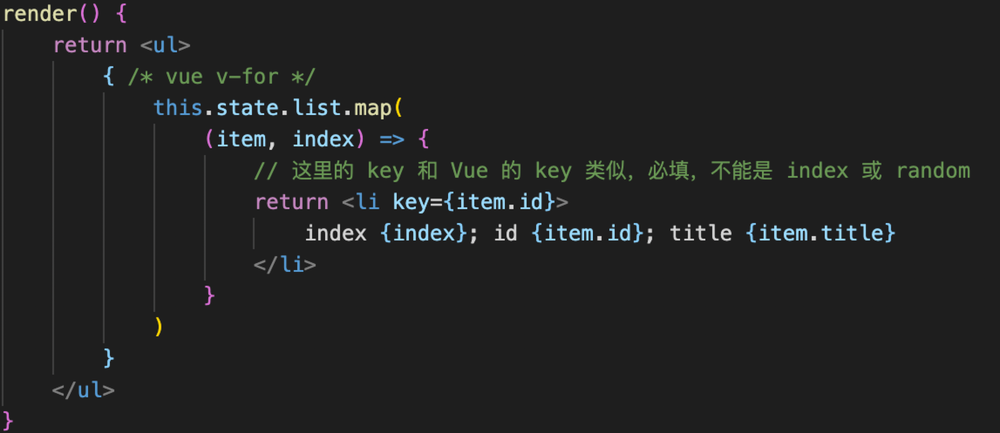
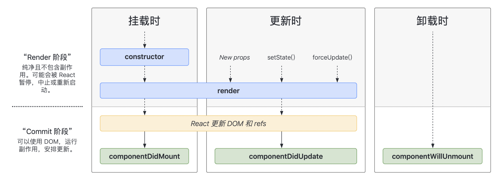

1. 变量、表达式
react的插值是使用一对{ }，{ }内可以写js变量、表达式    
扩展运算符...可以解构数组，原生js解构对象需要写{...obj}，react内置可以直接解构对象（react中的{}仅表示要使用js语法了）   
2. class style   
className=“”     
style=“”     style={{ }} 中间第一个大括号代表要包一个js变量，里层大括号是对象标示    
3. 子元素和组件   
原生html
``` javascript
const rawHtml = '<span>富文本内容<i>斜体</i><b>加粗</b></span>'
const rawHtmlData = {
    __html: rawHtml // 注意，必须是这种格式
}
const rawHtmlElem = <div>
    <p dangerouslySetInnerHTML={rawHtmlData}></p>
    <p>{rawHtml}</p>         //仅仅是文本
</div>
return rawHtmlElem
```
4. 条件判断：if eles \ 三元运算符 \ &&   
5. 列表渲染   

#### map是返回一个新的数组,list原本数组没有变   
6. 受控组件
把 input 和 state 的值关联起来了—>可以控制 input 里面的值   
```js
// 受控组件
return (
    <div>
        <p>{this.state.name}</p>
        <label htmlFor="inputName">姓名：</label> {/* 用 htmlFor 代替 for */}
        <input id="inputName" value={this.state.name} onChange={this.onInputChange} />
    </div>
);
onInputChange = e => {
    this.setState({
        name: e.target.value,
    });
};
```
(vue 中使用 v-model 双向数据绑定，里面改相应的数据就改了；react 联动的效果需要自己写)    
7. 非受控组件
input 输入的值不受 state 控制，输入与本身 state 没有关系（只是用 state 赋了初始值，没有写回调函数一点点存）    
创建 ref【react推荐使用React.createRef()的api创建】   
```js
constructor(props) {
    super(props)
    this.state = {
      name: '123',
      flag: true,
    }
    this.nameInputRef = React.createRef() // 创建 ref
    //React.createRef()调用后返回一个容器，该容器可以存储被ref所标示的节点
    this.fileInputRef = React.createRef()
}
```
**文件的时候必须得用 DOM 获得；某些富文本编辑器，需要传入 DOM 元素**     
🔔【其他ref用法】    
1)字符串ref="test"  this.refs.test  不推荐    
2)回调函数（内联：更新过程会执行两次，第一次会创建一个新的实例清空旧的ref）ref={(c)=>{this.input2 = c}}     
3)class绑定函数的形式不会调用两次  ref={this.saveInput}    
使用的属性变更为 defaultValue defaultChecked
8. 受控组件 vs 非受控组件
-   优先使用受控组件，符合 React 设计原则【数据驱动视图】   
-   必须操作 dom 时，再使用非受控组件   
9. 表单使用
-   textarea标签中间不能写东西，需要在标签里面写 value
-   input textarea select 都用 value
-   checkbox radio 用 checked
10. props
-   props 传递数据
-   props 传递函数 (vue：事件$emit)
-   props 类型检查、设置默认值
```js
import ProTypes from ‘prop-types'
List.propTypes = {  
    //propTypes是表示要定义规则，PropTypes是react封装的类
    list:PropTypes.arrayOf(PropTypes.object).isRequired     //必须有且必须为数组
}
``` 
11. super
super(props)构造器是否接收props是否传递给super，取决于是否希望在构造器中用this访问props   
es6要求子类的构造函数必须执行一次super函数，因为子类的this要继承父类，super代表了父类的构造函数，返回的是子类的实例this指向子类，子类再在父类的this基础上加工   
super当作对象使用，指向父类的原型对象super.c()相当于A.prototype.c()       
12. state
**状态（数据）提升：会把数据提升到最高级的组件（父组件）**  
- 函数组件默认没有
- 不可变值:
   不能通过 this.state 直接改变值，需要什么时候要改的时候什么时候使用 setState,并且不能影响之前的值
   concat 等对 tthis.state 操作可以返回一个需要的结果，但是不会对原来的数据有影响变化
- 其他操作需要先生成一份备份再进行操作,push 会提前对 state 的值进行改变是不行的🙅‍♀️
```js
// 不可变值（函数式编程，纯函数） - 数组
const list5Copy = this.state.list5.slice();
list5Copy.splice(2, 0, 'a'); // 中间插入/删除
this.setState({
    list1: this.state.list1.concat(100), // 追加
    list2: [...this.state.list2, 100], // 追加
    list3: this.state.list3.slice(0, 3), // 截取
    list4: this.state.list4.filter(item => item > 100), // 筛选
    list5: list5Copy, // 其他操作
});
// 注意，不能直接对 this.state.list 进行 push pop splice 等，这样违反不可变值
// 不可变值 - 对象
this.setState({
    obj1: Object.assign({}, this.state.obj1, { a: 100 }),
    obj2: { ...this.state.obj2, a: 100 },
});
// 注意，不能直接对 this.state.obj 进行属性设置，这样违反不可变值
```
- 可能是异步更新：
   setState 之后是异步渲染页面，setState 之后再去拿结果是之前的结果，可以在回调函数中拿最新的值   
```js
this.setState(
    {
        count: this.state.count + 1,
    },
    () => {
        // 联想 Vue $nextTick - DOM
        console.log('count by callback', this.state.count); // 回调函数中可以拿到最新的 state
    }
);
console.log('count', this.state.count); // 异步的，拿不到最新值
```
- 在 setTimeout 或自定义 DOM 事件中是同步的
```js
bodyClickHandler = () => {
    this.setState({
        count: this.state.count + 1
    })
    console.log('count in body event', this.state.count)
}
componentDidMount() {
    // 自己定义的 DOM 事件，setState 是同步的
    document.body.addEventListener('click', this.bodyClickHandler)
}
setTimeout(() => {
  this.setState({
    count: this.state.count + 1
  })
  console.log('count in setTimeout', this.state.count)
}, 0)
```
componentWillUnmout 中需要及时销毁自定义 DOM 事件  
- 可能会被合并
```js
// 传入对象，会被合并（类似 Object.assign ）。执行结果只一次 +1
this.setState({
    count: this.state.count + 1,
});
this.setState({
    count: this.state.count + 1,
});
this.setState({
    count: this.state.count + 1,
});
// 传入函数，不会被合并。执行结果是 +3
this.setState((prevState, props) => {
    return {
        count: prevState.count + 1,
    };
});
this.setState((prevState, props) => {
    return {
        count: prevState.count + 1,
    };
});
this.setState((prevState, props) => {
    return {
        count: prevState.count + 1,
    };
});
```  
异步更新，当时的 state 的值还都没更新   
如果传入函数是不会执行合并的（函数是一个个对象本身就不能合并；值一样的就可以合并）   
13. 生命周期
- 16.8生命周期


- 17生命周期
- 改变三个原有的生命周期
因为滥用可能导致一些问题：componentWillReceiveProps componentWillUpdate componentWillMount    
需要加前缀UNSAFE_，不加也可以兼容，但浏览器有警告提示   
- 新增两个生命周期
getDerivedStateFromProps【是静态方法】
```js
//若state的值在任何时候都取决于props，那么可以使用getDerivedStateFromProps
static getDerivedStateFromProps(props,state){
  console.log('getDerivedStateFromProps',props,state);
  return null
}
```
getSnapshotBeforeUpdate   
触发更新之前可以存储快照，可能出现在 UI 处理中，如需要以特殊方式处理滚动位置的聊天线程等      
```js
getSnapshotBeforeUpdate(){
  return this.refs.list.scrollHeight //传给componentDidUpdate
  //(即更新之前，保存一下原来的状态，再把它传给更新时候的函数)
}
```