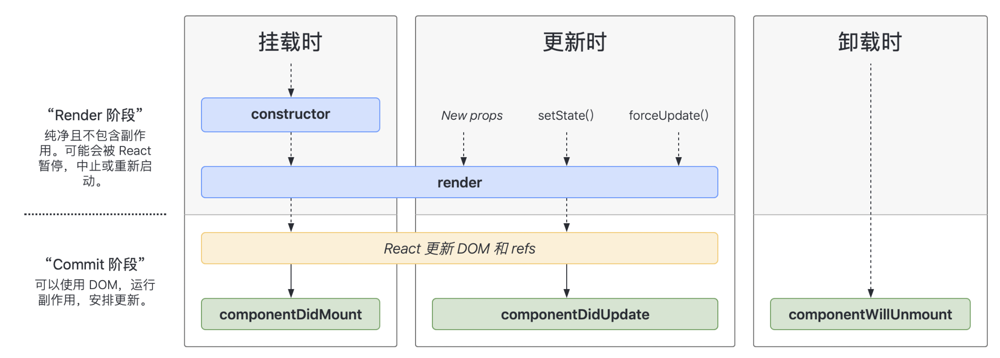
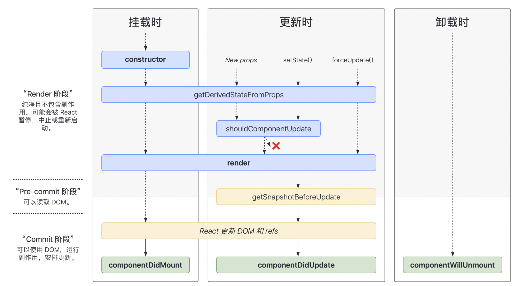

#### 16.8生命周期
#### 17生命周期
- 改变三个原有的生命周期
因为滥用可能导致一些问题：componentWillReceiveProps componentWillUpdate componentWillMount    
需要加前缀UNSAFE_，不加也可以兼容，但浏览器有警告提示   
- 新增两个生命周期
getDerivedStateFromProps【是静态方法】
```js
//若state的值在任何时候都取决于props，那么可以使用getDerivedStateFromProps
static getDerivedStateFromProps(props,state){
  console.log('getDerivedStateFromProps',props,state);
  return null
}
```
getSnapshotBeforeUpdate   
触发更新之前可以存储快照，可能出现在 UI 处理中，如需要以特殊方式处理滚动位置的聊天线程等      
```js
getSnapshotBeforeUpdate(){
  return this.refs.list.scrollHeight //传给componentDidUpdate
  //(即更新之前，保存一下原来的状态，再把它传给更新时候的函数)
}
```
