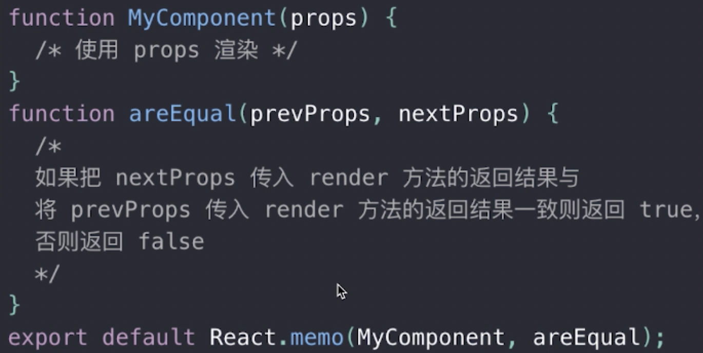
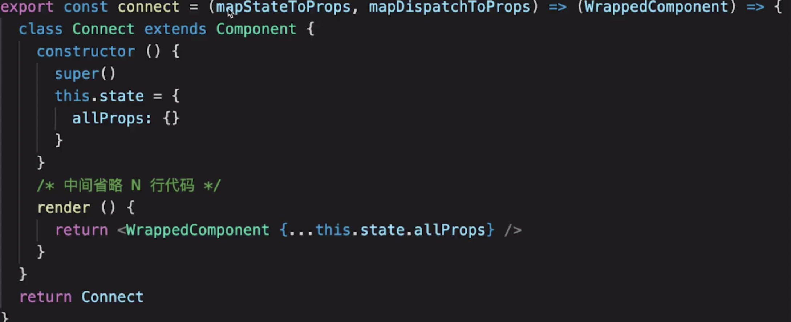
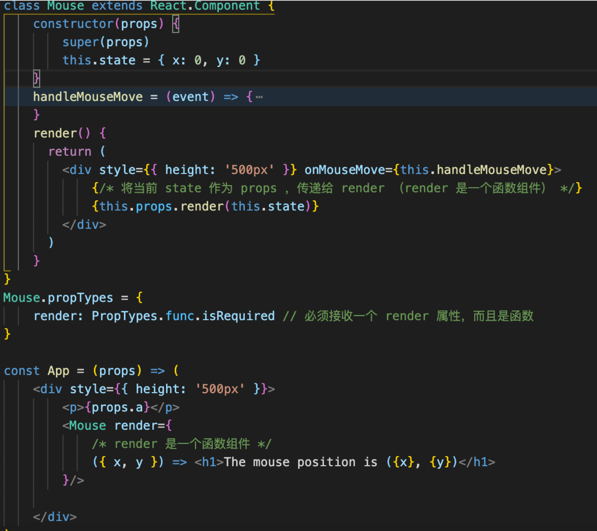

1. 函数组件
只接收props进行渲染没有state就可以使用函数组件
* 纯函数，输入props输出jsx
* 没有实例，没有生命周期，没有state
* 不能扩展其他的方法输出tanshuikafei
```js
function List(props){
    const {list} = this.props;
    return <ul>
        {list.map(item,index)=>{
            return <li key={item.id}>
                    <span>{item.title}</span>
                </li>
        }}
    </ul>
}
```
2. Portals【传送门】
组件默认会按照既定层次嵌套渲染，但有些时候需要把自组件渲染到父组件以外
（比如一层层嵌套里面，有一个组件显示是fixed）
使用场景：overflow:hidden    父组件z-index值太小    fixed需要放在body第一层级
```js
render() {
    // return <div className="modal">
    //     {this.props.children} {/* vue slot */}
    // </div>

    // 使用 Portals 渲染到 body 上。
    // fixed 元素要放在 body 上，有更好的浏览器兼容性。
    return ReactDOM.createPortal(
         <div className="modal">{this.props.children}</div>,
         document.body // DOM 节点
    )
  }
```
第二个参数是指要渲染到什么地方去，但不会改变React组件结构
3. context
当用props太繁琐、用redux小题大做时
* 1)定义
```js
// 创建 Context 填入默认值（任何一个 js 变量）
const ThemeContext = React.createContext('light')
```
* 2)在DOM最外层使用，包裹起来
```js
class App extends React.Component {
    constructor(props) {
        super(props)
        this.state = {
            theme: 'light'
        }
    }
    render() {
        return <ThemeContext.Provider value={this.state.theme}>
            <Toolbar />
            <hr/>
            <button onClick={this.changeTheme}>change theme</button>
        </ThemeContext.Provider>
    }
    changeTheme = () => {
        this.setState({
            theme: this.state.theme === 'light' ? 'dark' : 'light'
        })
    }
}
```
在最外层通过ThemeContext.Provider去生产、管理state里面这个值；之后子组件里都有消费这个数据的能力
* 3)中间组件：再也不必指明往下传递的数据了
如果中间组件需要使用数据，和最下层组件使用一致
```js
function Toolbar(props) {
    return (
        <div>
            <ThemedButton />
            <ThemeLink />
        </div>
    )
}
```
* 4)底层组件消费数据
* 类组件
 - （1）绑定指定的contextType
 - （2）从下往上找数据，this.context获取
* 函数组件：不能使用this
```js
// 底层组件 - 函数是组件
function ThemeLink (props) {
    // const theme = this.context // 会报错。函数式组件没有实例，即没有 this

    // 函数式组件可以使用 Consumer
    return <ThemeContext.Consumer>
        { value => <p>link's theme is {value}</p> }
    </ThemeContext.Consumer>
}

// 底层组件 - class 组件
class ThemedButton extends React.Component {
    // 指定 contextType 读取当前的 theme context。
    // static contextType = ThemeContext // 也可以用 ThemedButton.contextType = ThemeContext
    render() {
        const theme = this.context // React 会往上找到最近的 theme Provider，然后使用它的值。
        return <div>
            <p>button's theme is {theme}</p>
        </div>
    }
}
ThemedButton.contextType = ThemeContext // 指定 contextType 读取当前的 theme context。
//组件的contextType属性等于上面创建定义的值
```
4. 异步组件：组件比较大的时候、懒加载
import( )
React.lazy
React.Suspense
```js
import React from 'react'

const ContextDemo = React.lazy(() => import('./ContextDemo'))

class App extends React.Component {
    constructor(props) {
        super(props)
    }
    render() {
        return <div>
            <p>引入一个动态组件</p>
            <hr />
            <React.Suspense fallback={<div>Loading...</div>}>
                <ContextDemo/>
            </React.Suspense>
        </div>

        // 1. 强制刷新，可看到 loading （看不到就限制一下 chrome 网速）
        // 2. 看 network 的 js 加载
    }
}
export default App
```
可以把异步引用的组件重新封装成一个组件，然后在dom中用React.Suspense可以等待
5. 性能优化
#### ⭐️重点
（性能优化对React更重要，相对Vue对性能优化没那么重要）
【1】shouldComponentUpdate(scu)
```js
shouldComponentUpdate(nextProps, nextState) {
    if (nextState.count !== this.state.count) {
        return true // 可以渲染
    }
    return false // 不重复渲染
}
```
React默认父组件有更新，子组件则无条件也更新
* SCU默认会返回true，可以通过对比（_isEqual( )深度比较），如果一样就不重新渲染
* SCU不一定每次都用，需要的时候才优化
* SCU一定要配合不可变值
父组件的方法里如果这么写，会导致state提前变了值，之后把两个相等的值再进行赋值相等。会导致子组件里两个props相等不触发刷新
```js
// 增加 shouldComponentUpdate
    shouldComponentUpdate(nextProps, nextState) {
        // _.isEqual 做对象或者数组的深度比较（一次性递归到底）
        if (_.isEqual(nextProps.list, this.props.list)) {
            // 相等，则不重复渲染
            return false
        }
        return true // 不相等，则渲染
    }
```
不建议深度比较，比较耗费性能
【2】PureComponent和React.memo（纯组件和备忘录）
class组件：PureComponent在SCU中实现了浅比较
函数组件：memo

【3】不可变值immutable.js
每次赋值都重新深拷贝一份，导致性能差
immutable基于共享数据（不是深拷贝），速度好
const map1 = Immutable.Map({a:1,b:2})
const map2 = map1.set({‘b’,50})    //两个分开了
6. 高阶组件hoc
关于组件公共逻辑的抽离
若函数接收的参数是一个函数或返回的值是一个参数则为高阶组件   
定义一个HOC，本身是一个函数，接收一个组件返回一个包含公共逻辑的新组件
```js
const HOCFactory =(Component)=>{
    class HOC extends React.Compopnent{
        return <Component {…this.props}/>
    }
    return HOC
}
const EnhancedComponent1 = HOCFactory(WrappedComponent1)
```
在组件里通过props获取写的公共逻辑；在高阶组件里面用div包裹一下传入的组件，再在div写逻辑
```js
const withMouse = (Component) => {
    class withMouseComponent extends React.Component {
        constructor(props) {
            super(props)
            this.state = { x: 0, y: 0 }
        }
  
        handleMouseMove = (event) => {
            this.setState({
                x: event.clientX,
                y: event.clientY
            })
        }
  
        render() {
            return (
                <div style={{ height: '500px' }} onMouseMove={this.handleMouseMove}>
                    {/* 1. 透传所有 props 2. 增加 mouse 属性 */}
                    <Component {...this.props} mouse={this.state}/>
                </div>
            )
        }
    }
    return withMouseComponent
}
const App = (props) => {
    const a = props.a
    const { x, y } = props.mouse // 接收 mouse 属性
    return (
        <div style={{ height: '500px' }}>
            <h1>The mouse position is ({x}, {y})</h1>
            <p>{a}</p>
        </div>
    )
}
```
在Redux中connect就是高阶组件：第一个参数传入函数返回一个函数、再第二个参数传入组件
```js
// connect 高阶组件，将 state 和 dispatch 注入到组件 props 中
const VisibleTodoList = connect(
  mapStateToProps,
  mapDispatchToProps
)(TodoList)
```
connect源码

Vue如何实现高阶组件？
函数的柯里化：通过函数调用继续返回函数的方式，实现多次接收参数最后统一处理的形式   
```js
<form onSubmit={this.handleSubmit}>
    用户名：<input onChange={this.saveFormData('username')} type="text" name="username"/>
    密码：<input onChange={this.saveFormData('password')} type="password" name="password"/>
    <button>登录</button>
</form>
//保存表单数据到状态中
saveFormData = (dataType)=>{   //需要的传参
    return (event)=>{  //react自动触发的，接收一个事件参数
        this.setState({[dataType]:event.target.value})   //[]的形式可以找到state对象中的对应属性
    }
}
//不用柯里化的实现方式：传自己的参数再补充传事件参数
<input onChange={event => this.saveFormData('username',event) } type="text" name="username"/>
```
7. RenderProps
通过一个函数将class组件的state作为props传递给纯函数组件
是APP组件包裹其他组件实现公共逻辑

子组件（定义的包含公共逻辑的组件）调用props的render方法传入自己的state
即，定义了 Mouse 组件，只有获取 x y 的能力。至于 Mouse 组件如何渲染，App 说了算，通过 render prop 的方式告诉 Mouse 。
Hoc需要porps之后定义一个属性接收xy，renderprops直接可以获取属性
HOC VS RenderProps:
HOC模式简单，但会增加组件层级；Renderprops代码简洁，学习成本较高
