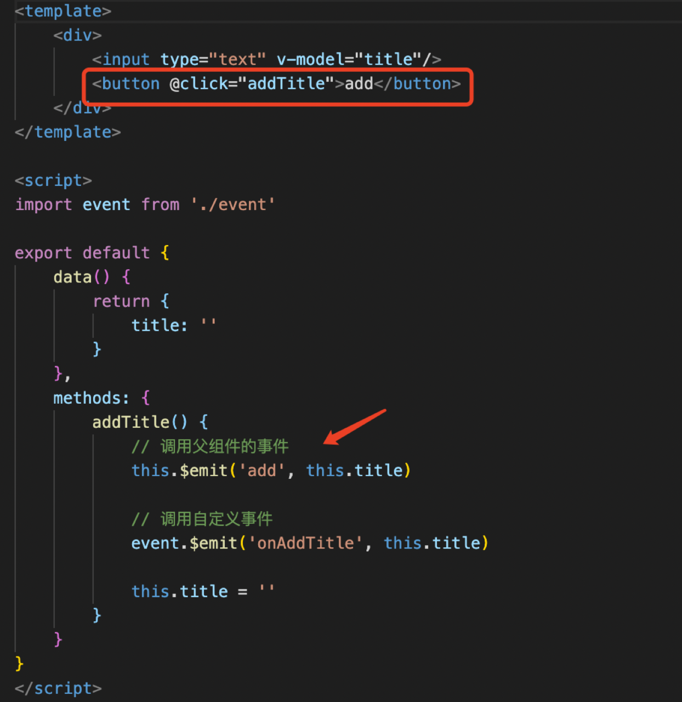

1. props和$emit
props代表父组件向子组件传递一个信息
emit代表子组件触发一个父组件的事件
#### 【父子组件通讯】子组件触发点击事件的时候，调用父组件传入进来的事件

emit后面写的是父组件事件接收的名称
父组件：
```html
<template>
    <div>
        <Input @add="addHandler"/>
        <List :list="list" @delete="deleteHandler"/>
    </div>
</template>
```
```js
methods: {
    addHandler(title) {
      this.list.push({
          id: `id-${Date.now()}`,
          title
      })
    },
    deleteHandler(id) {
      this.list = this.list.filter(item => item.id !== id)
    }
},
```
注：子组件接收传入的数组，两种写法均可，但第二种能设置默认值
```js
 props: {
        text1: String,
        default() {
            return ''
        }
    }
```
2. 组件间通讯 - 自定义事件
1)父子组件通讯（以上）   
2)自定义组件通讯（自定义事件）   
A组件
```js
mounted() {
    // 绑定自定义事件
    event.$on('onAddTitle', this.addTitleHandler)
},
beforeDestroy() {
    // 及时销毁，否则可能造成内存泄露
    event.$off('onAddTitle', this.addTitleHandler)
}
```
（与methods并列）
用的函数的名字而不是直接写的()=>{}，是为了方便函数的解绑
都需要
```js
import event from './event’
//event文件实例vue
import Vue from 'vue'
export default new Vue()
```
B组件
```js
methods: {
    addTitle() {
        // 调用父组件的事件
        this.$emit('add', this.title)

        // 调用自定义事件
        event.$emit('onAddTitle', this.title)

        this.title = ''
    }
}
```
3. 组件生命周期
挂载—>更新—>销毁  
beforeCreate —>    create  —>   beforeMount  —>   mounted  —>    beforeUpdate    —>    updated    —>    beforeDestroy    —>    destroyed  
create是把vue的实例初始化了，存在于js的内存变量中并没有开始渲染  
mounted是组件真正绘制完了  
beforeDestroy可以解除绑定、销毁子组件以及事件监听器  
#### 【带有父子组件的生命周期】  
1)先是父组件创建js模型，然后再是自组件创建js模型；然后先是子组件渲染，然后再是父组件渲染  
（index create    —>    list created    —>    list mounted    —>    index mounted）  
创建js实例的顺序是从外到内的，渲染的顺序是从内到外的  
2)先是父组件触发更新，再是子组件先实施更新  
index beforeUpdate    —>    list beforeUpdate    —>    list update    —>    index update  
