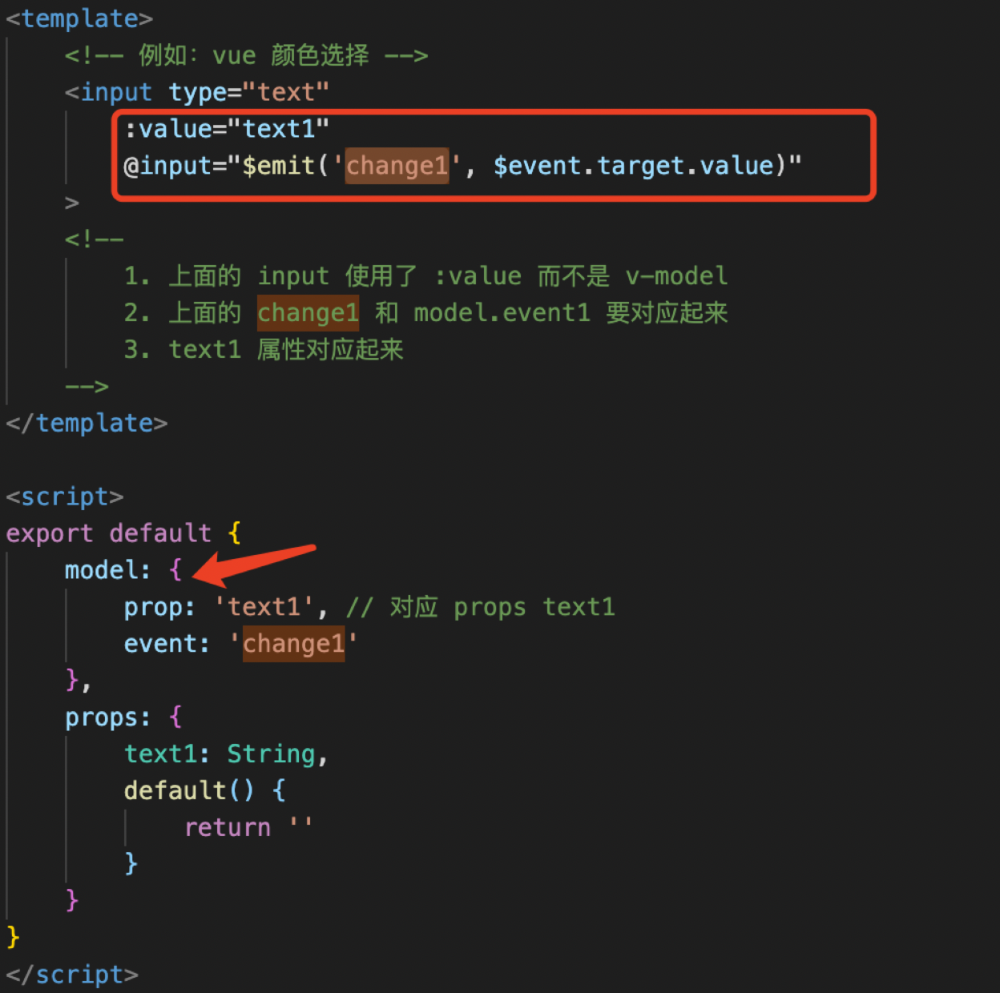
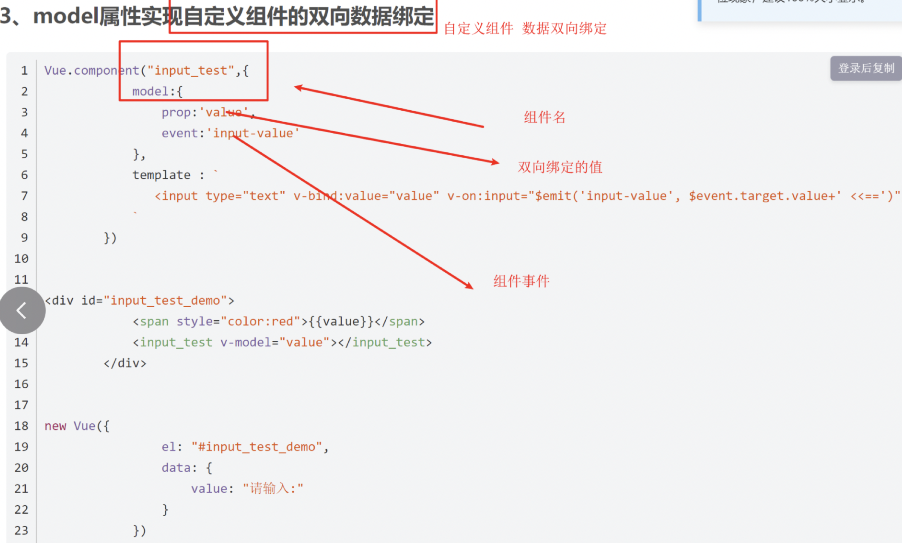
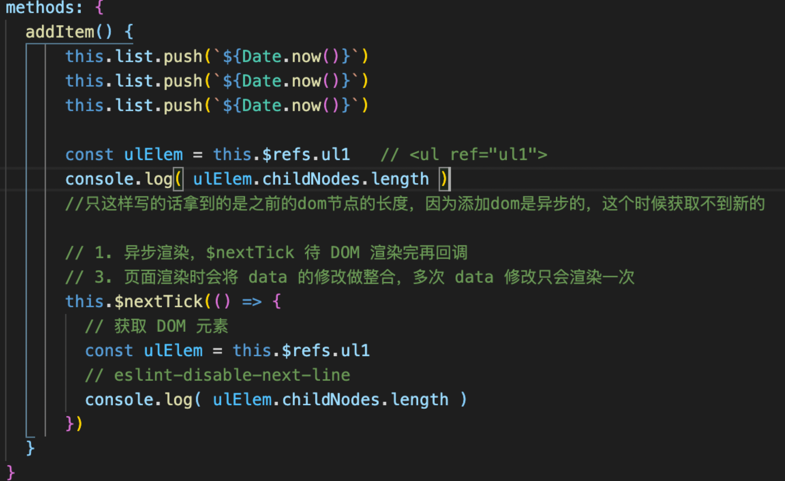
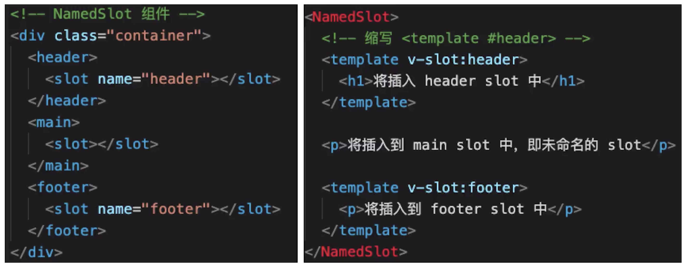
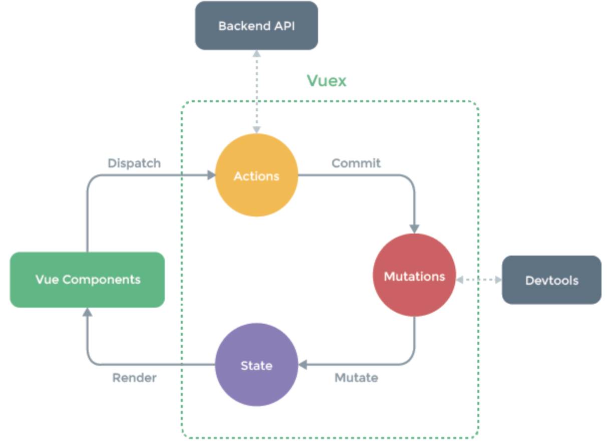

1. 自定义v-modal



2. $nextTick   
Vue是异步渲染框架，data改变之后DOM不会立刻渲染，$nextTick会在DOM渲染之后被触发以获取最新的DOM节点


3. slot插槽（父组件想要往子组件里插点东西）
* 基本使用  
slot标签接收外面引用的标签的子节点，并可以设置默认内容
（可以替换原来组件的内容，比如增量或者复用的时候需要展示新的内容）    

子组件标签写法：
```html
<slot>
    默认内容，即父组件没设置内容时，这里显示
</slot>
```
外面父组件传参
```html
<SlotDemo :url="website.url">
    {{website.title}}
</SlotDemo>
```
* 作用域插槽   
（可能要求既要传进去新的属性内容，又要显示原来的内容，就需要子组件传出来值）   

父组件:v-slot后面名称随便，文本插值中使用这个名称，并点子组件接收的名称，再点内容属性
```html
 <ScopedSlotDemo :url="website.url">
            <template v-slot="slotProps">
                {{slotProps.slotData.title}}  <!-- 把子组件原来的内容暴露出来，继续显示子组件内容 -->
            </template>
        </ScopedSlotDemo>
```
子组件
```js
<template>
    <a :href="url">
        <slot :slotData="website">
            {{website.subTitle}} <!-- 默认值显示 subTitle ，即父组件不传内容时 -->
        </slot>
    </a>
</template>

<script>
export default {
    props: ['url'],
    data() {
        return {
            website: {
                url: 'http://wangEditor.com/',
                title: 'wangEditor',
                subTitle: '轻量级富文本编辑器'
            }
        }
    }
}
</script>
```
* 具名插槽   
name和v-slot对应起来，不写name使用默认   


4. 动态异步组件   

1）动态组件   
（需要根据数据动态渲染场景，即组件类型不确定：比如一个新闻页面，不确定用text img还是视频组件）   
:is = ‘component-name’   
is是绑定动态的一个值
```html
<div v-for=“(val,key) in newsData” :key=“key”>
    <component :is=“val.type">
</div>
```
2）异步组件   
如果比较大的组件直接加载会比较卡，影响性能—>按需加载，异步加载大组件
```js
components: {
        SlotDemo,
        FormDemo: () => import('../BaseUse/FormDemo'),
    },
```
上面的import是同步引入，一共打一个包；使用函数引用（动态import函数）   

5. keep-alive   
缓存组件：频繁切换，不需要重复渲染—— 【Vue常见性能优化】
```html
<keep-alive> <!-- tab 切换 -->
    <KeepAliveStageA v-if="state === 'A'"/> <!-- v-show -->
    <KeepAliveStageB v-if="state === 'B'"/>
    <KeepAliveStageC v-if="state === 'C'"/>
</keep-alive>
```
每个组件只走mounted不走销毁生命周期，再点击不重新mounted不重新渲染

6. mixin——汇合，多个组件有相同的逻辑会抽离出来
```js
mixins: [myMixin], // 可以添加多个，会自动合并起来
//import myMixin from './mixin'里面可以写data\methods等
```
多mixins可能会有变量冲突，变量来源不明不利于阅读，和组件可能出现多对多的关系复杂度高
【Vue3提出的Composition API旨在解决这些问题】

7. vuex


