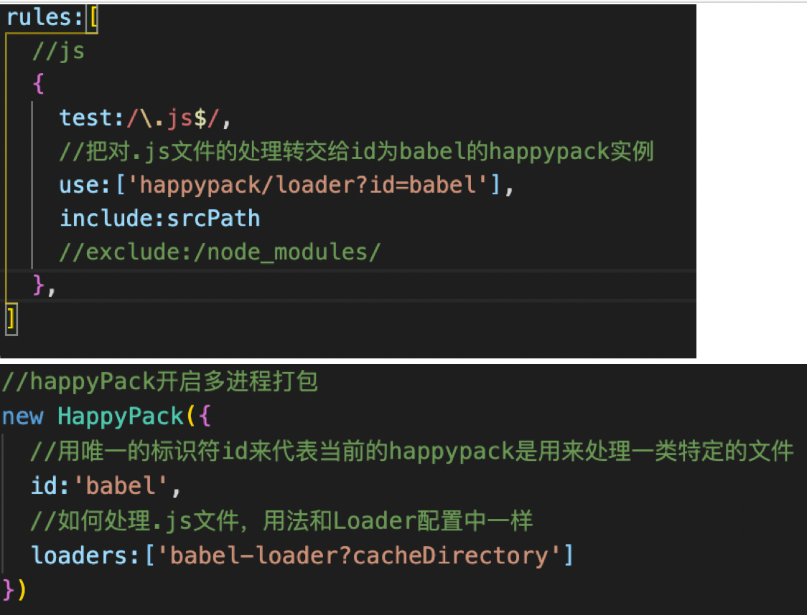
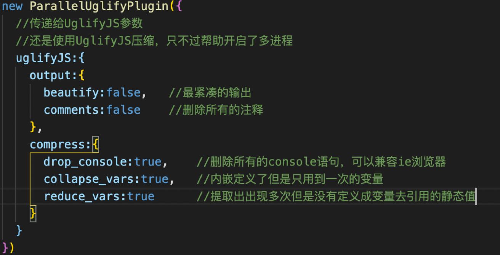

1. 前端优化可以从哪些方面进行   
**【多使用内存、缓存，减少CPU计算量，减少网络加载耗时】**   
- DOM性能优化：1️⃣对DOM查询做缓存 2️⃣将频繁操作改为一次性操作（创建文档碎片最后插入到DOM中）   
```js
const listNode = document,getElementById('list')
const frag = document.createDocumentFragment()
for(let i = 0;i<10;i++){
  const li = document.createElement('li')
  frag.appendChild(li)
}
istNode.appendChild(frag)
```
- 为了减少网络请求进行资源合并、压缩代码    
- 缓存,打包的时候使用[contenthash]    
静态资源加hash后缀，根据文件内容计算hash，文件内容不变则hash不变，则url不变，url和文件不变则会自动触发http缓存机制返回304   
- CDN(内容分发网络：通过中心平台的负载均衡、内容分发、调度等使用户获取就近内容)
- SSR服务端渲染：将网页和数据一起加载一起渲染；（减少网络请求）    
非SSR（前后端分离）：先加载网页，再加载数据，再渲染数据     
- 懒加载：前面图片加载完，后面的慢慢加载完   
给图片先设置一个默认的小的预览图片，真正的放在data-realsrc里面，当浏览器判断到上滑浏览到图片露出屏幕（dom设置）时候再加载    
vue中可以用is   
- 防抖、节流   
防抖:拖拽一个元素时，要实时拿到当前元素的位置，如果直接用drag事件频繁触发会卡顿,所以一段时间后一起触发   
节流：无论拖拽速度多快，每100ms触发一次   
```js
//封装防抖
function debounce(fn, delay = 500){
  let timer = null; //注意是在闭包中
  return function(){  //函数作为返回值就形成闭包了
    if(itmer){
      clearTimeout(timer)
    }
    timer = setTimeout(()=>{
      fn.apply(this,arguments)
      timer = null
    },delay)
  }
}
input1.addEventListener('keyup',debounce(()=>{
  console.log(input1.value)
}),600)

//封装节流
function throttle(fn, delay = 100){
  let timer = null
  return function(){
    if(timer){
      return
    }
    timer = setTimeout(()=>{
      fn.apply(this,arguments)
      timer = null
    },delay)
  }
}
div1.addEventListener('drag',throttle(function(e){
  console.log(e.offsetX,e.offsetY)
},200))
```
- webpack优化
**【优化打包构建速度 - 开发体验和效率】**
1️⃣优化babel - loader   
```js
{
    test:/\.js$/,
    use:[‘babel-loader?cacheDirectory],  //开启缓存. 【es6代码没有改代码的就不会重新编译就会缓存一下】
    include:path.resolve(__dirname ,’src’)
    //排除范围include 和exculde两者选一个即可
    //exclude:path.resolve(__dirname,’node_modules')
}
```
2️⃣IgnorePlugin避免引入无用模块   
比如引入moment只使用中文，避免引入过多语言   
```js
//plugin
new webpack.IgnorePlugin(/\.\/locale/,/moment/). //忽略moment下的/local目录
//js文件中
Import ‘moment/local/zh-cn’. //手动引入中文语言包
```
3️⃣noParse避免重复打包   
```js
Module.exports = {
    module:{
        //读完整的react.min.js文件就没有采用模块化
        //忽略对react.min.js文件的递归解析处理
        noParse:[/react\.min\.js$/]  【这种基本上已经是采用模块化处理过的，不用再打包，只要检查到这个就不会去打包】
    }
}
```
IgnorePlugin直接不引入，代码中没有，需要什么自己去引     
noParse引入，但不打包.   【都既优化了打包速度又优化了产出体积】     
4️⃣happyPack 多进程打包   
Js单线程，开启多进程打包   
提高构建速度（特别是多核CPU）   
const HappyPack = require(‘happypack’)

5️⃣ParallelUglifyPlugin多进程压缩js    
webpack内置Uglify工具压缩js   
js单进程，开启多进程压缩更快    
原理和happyPack同理    
插件const ParallelUglifyPlugin = require(‘webpack-parallel-uglify-plugin’)    
   
关于开启多进程：
项目比较大，打包较慢，开启多进程能提高速度
项目比较小，打包很快，开启多进程会降低速度（进程开销）
☞自动刷新
☞热更新
☞DllPlugin
- vue优化
1️⃣合理使用v-show if\合理使用computed\v-for加key\及时销毁\合理使用异步组件\合理使用keep-alive\data层级不要太深   
2️⃣使用vue-loader在开发环境做模版编译（预编译）
- React优化
1️⃣在constructor构造器中bind（this）比较好，这样无论点击多少次都只bind一次；     
如果是在render里面绑定，每点击一次都需要重新bind都要重新返回一个新的函数【效率不好】    
2️⃣React-fiber如何性能优化   
patch比较在React中被拆分为两个阶段：   
* reconciliation阶段-执行diff算法，纯JS计算   
* commit阶段-将diff结果渲染到DOM   
原因：js是单线程，且和DOM渲染共用一个线程，当组件足够复杂，组件更新时计算和渲染压力都很大，同时再有dom操作会卡顿   
fiber【内部运行机制】将recociliation阶段进行任务拆分（commit无法拆分）   
DOM需要渲染时暂停，空闲时恢复   
通过window.requestidleCallback这个API来判断什么时候DOM渲染    
2. tcp与udp的区别
- tcp **面向连接**    
1、在收发数据的时候，必须和对方建立可靠的连接【三次握手】【四次挥手】   
三次握手过程中，没有应用层的数据 ,SYN这个标志位只有在TCP建立连接时才会被置1 ,握手完成后SYN标志位被置0。   
备注：
（1）ACK：是TCP报头的控制位之一，对数据进行确认。确认由目的端发出， 用它来告诉发送端这个序列号之前的数据段都收到了。 比如确认号为X，则表示前X-1个数据段都收到了，只有当ACK=1时,确认号才有效，当ACK=0时，确认号无效，这时会要求重传数据，保证数据的完整性。   
（2）SYN：同步序列号，TCP建立连接时将这个位置1。   
（3）FIN：发送端完成发送任务位，当TCP完成数据传输需要断开时,，提出断开连接的一方将这位置1。   
2、TCP包头的最小长度，为20字节。
3、一对一连接
- udp **面向报文**   
1、传输数据之前源端和终端不建立连接， 简单地去抓取来自应用程序的数据，并**尽可能快**地把它扔到网络上。
2、不需要维护连接状态，包括收发状态等， 因此**一台服务机可同时向多个客户机**传输相同的消息。
3、UDP信息包的标题很短，只有8个字节，相对于TCP的20个字节信息包的额外开销很小。
4、吞吐量不受拥挤控制算法的调节，只受应用软件生成数据的速率、传输带宽、 源端和终端主机性能的限制。
5、UDP使用尽最大努力交付，**即不保证可靠交付**， 因此主机不需要维持复杂的链接状态表（这里面有许多参数）。
6、UDP是面向报文的。发送方的UDP对应用程序交下来的报文， 在添加首部后就向下交付给IP层。既不拆分，也不合并，而是保留这些报文的边界， 因此，应用程序需要选择合适的报文大小。
**【总的来说】**
1、基于连接与无连接；   
2、对系统资源的要求（TCP较多，UDP少）；   
3、UDP程序结构较简单；   
4、流模式与数据报模式 ；   
5、TCP保证数据正确性，UDP可能丢包；   
6、TCP保证数据顺序，UDP不保证   
3. get和post的区别   
GET 向服务器获取指定资源
POST 向服务器提交数据，数据放在请求体里
GET 用于获取信息，是无副作用的，是幂等的，且可缓存， 而POST 用于修改服务器上的数据，有副作用，非幂等，不可缓存。
4. 为什么需要初始化css样式
- 兼容问题，不同浏览器对有些标签的默认值是不同的，如果没对CSS初始化往往会出现浏览器之间的页面显示差异。
- 提高编码质量，可能重复的CSS样式很多。去掉标签的默认样式如：margin,padding，其他浏览器默认解析字体大小，字体设置。
5. Dom事件有哪些阶段
- 从文档的根节点流向目标对象（捕获阶段）
事件从文档的根节点出发，随着DOM树的结构向事件的目标节点流去。途中经过各个层次的DOM节点，并在各节点上触发捕获事件，直到到达事件的目标节点。捕获阶段的主要任务是**建立传播路径**，在冒泡阶段，事件会通过这个路径回溯到文档跟节点。当事件发生时，首先发生的是事件捕获，**为父元素截获事件提供了机会。**
- 然后在目标对向上被触发（目标阶段）
- 之后再回溯到文档的根节点（冒泡阶段）.
6. 描述cookie与session
cookie   
- 存储在浏览器的一段字符串（最大5kb）   
- 跨域不共享   
- 是结构化数据 key=value;   
- 每次发送http请求，会将请求域的cookie一起发送给server   
- server端可以修改cookie并返回给浏览器   
- 浏览器中也可以通过javascript修改cookie（有限制）   
- 客户端可以累加cookie   
- cookie跨域不共享   
session   
- 存储会话信息(存储特定用户会话所需的属性和配置信息)   
session是一种解决问题的方法，cookie存储数据大小有限，可以在cookie中存储userId（随机字符串），然后通过userId读取session中的username等信息   
如果cookie中没有userId,先设置一个标志，需要生成新的cookie；如果没有session内容，先初始化一个空对象
req.session = SESSION_DATA[userId]   
SESSION_DATA为后端的一个JS变量，存储在进程被操作系统分配的内存中   